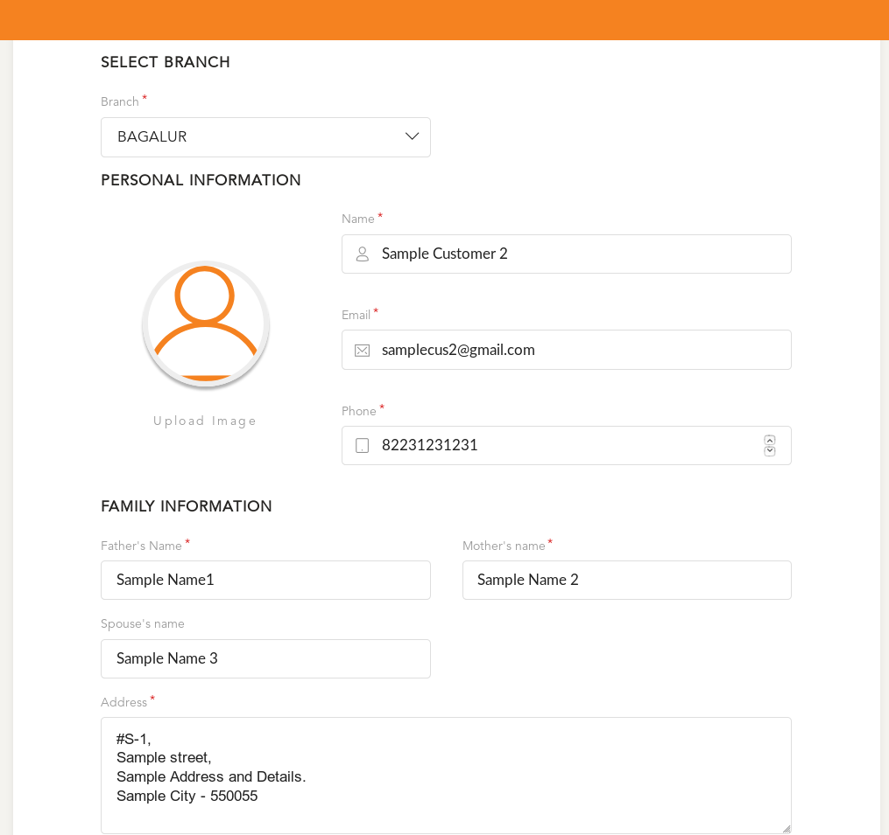
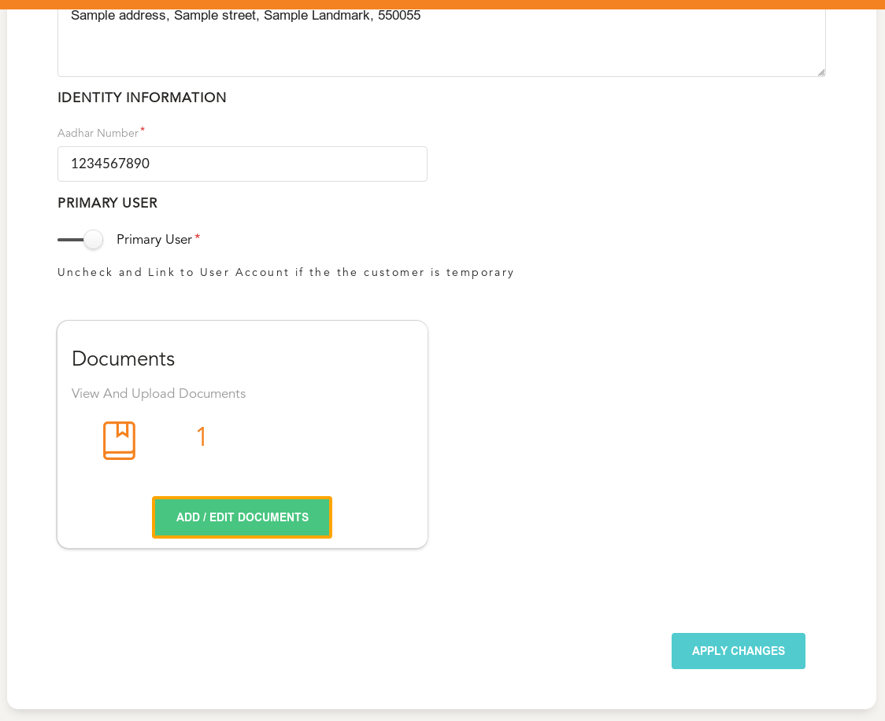
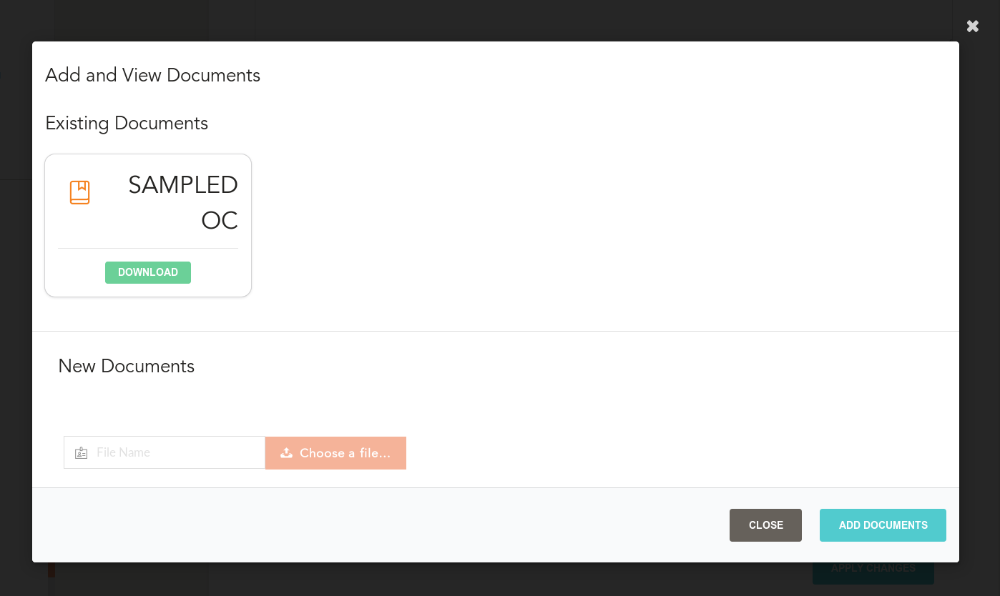
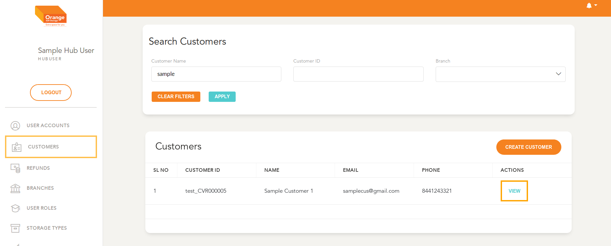
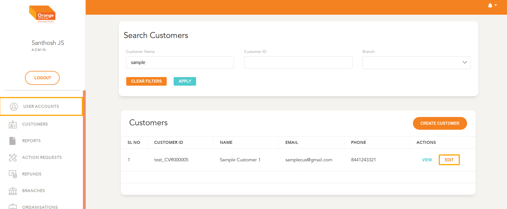
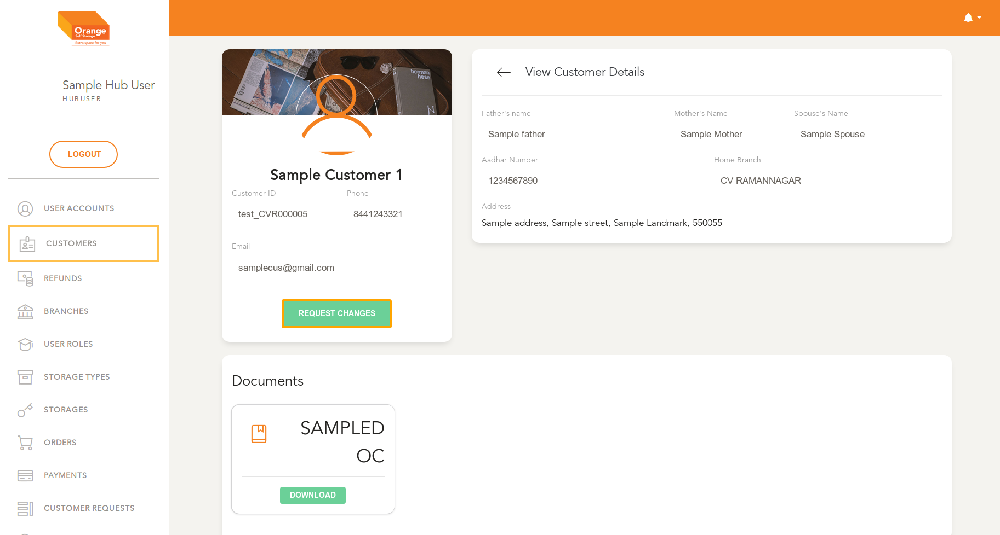
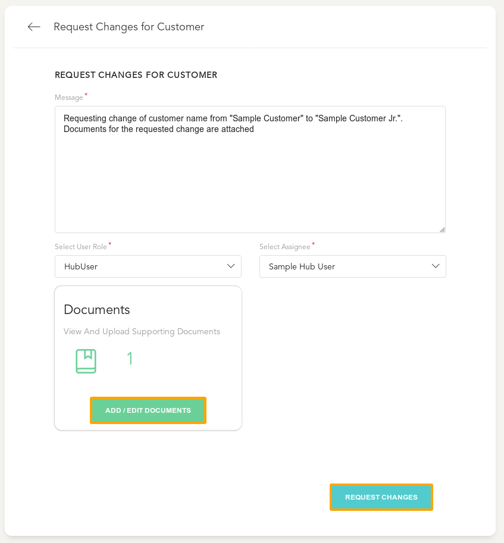

## Phase 1: Setup Customer Details

  **This Module can be accessed by clicking on `Create Customer` in the Action Items**
  -
  
  - Fill out all Mandatory and Optional Fields in the form
  -  

  - Upload any necessary Documents for the Customer
  - Select `Add/Edit Documents` To add documents to the Customer Profile
  -  

  - Select if this is a `Primary` or a `Temporary` User
    > Primary User:
      - Access to All customer modules
      - Have their own User account and can place individual orders
      - Can be Linked to Organisation Accounts without further processing
      - No Expiry

    > Temporary User:
      - Access To only Linked accounts on temporary basis
      - Require to be linked to an existing User account
      - Have automated Expiry Date
      - Used when you have users who need temporary access to account holder's assets 

  - Select Any number of documents that are required to be stored against this user
  -    

  - Save and confirm Customer creation with `Create A User` button
    - This will create a Customer
  -    

# View Details / Add Comments

  - User can view a customer in detail by clicking `View` from the table
  -

# Edit Details

  >- As Admin:
    - Edit Customer Details Directly
    - Upload additional Documents
    -
    

  >- As Hub User:
    - Every Edit is added through a `Change Request`
    -
     
    - After Selecting Change Request, Add the necessary Details of the required change
    - Assign the specific change request to a specific Hub User* (optional)
    - Add any supporting Documents for this change
    - Create Change Request by clicking `Request Changes`
    -
