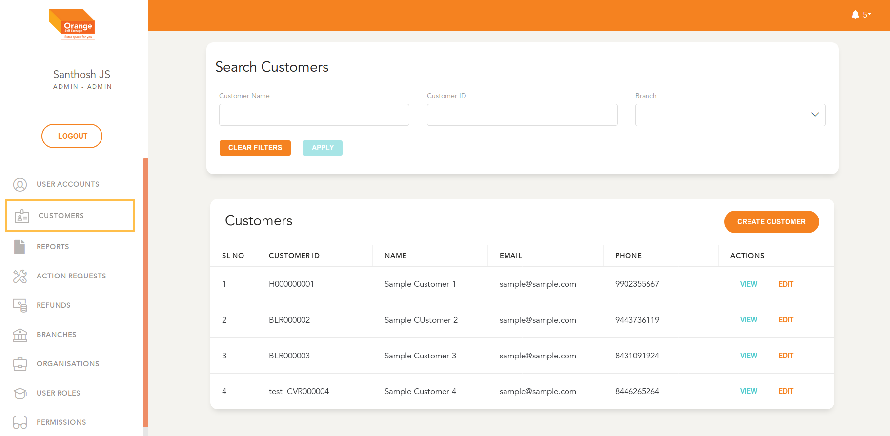
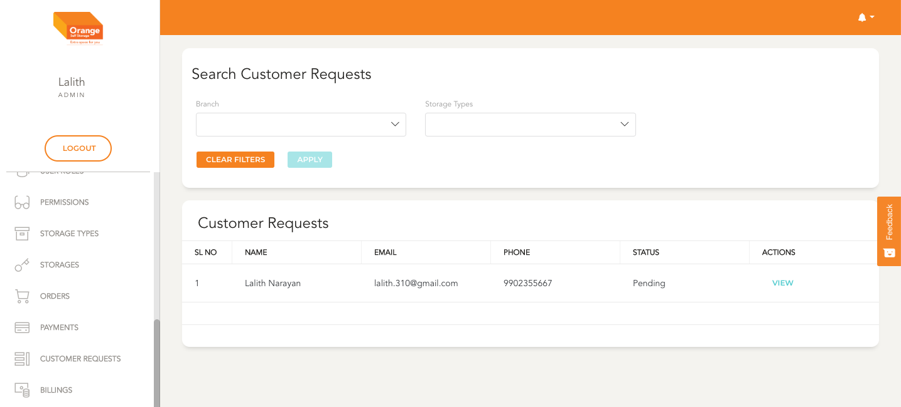
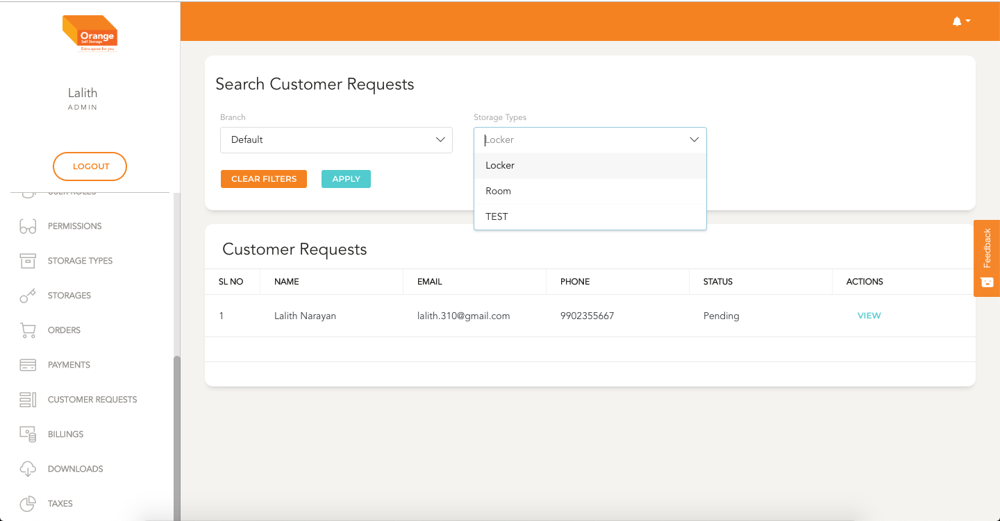

# Customer Account Management

#### Prerequisites:
  - Customer Request has been approved (optional)
  - Customer is not already existent in system
  - Customer email and phone number are verified by the enrolling team

# List
  **This Module can be accessed by clicking on `Customers` in the side navigation Bar**
  

  - All the Customers are listed here in a chronological order
  - All the requests are shown here ex Customer Name, Phone, Email
  - User can view the details and modify by clicking `View`
  - The list can be filtered by Customer Name (Search), Customer ID and Branch
  - Click `Apply` to view the filtered details
  - To clear the applied filtered Click `clear Filters`
 

  
 

  
 

### Quick references:

  * [Customer Request Management](customers/customerRequests.md)
  1. [Phase 1: Customer Details](customers/create.md) 
  1. [Phase 2: Customer Account Creation](customers/create.md)
  * [User Account Verification](customerRequests.md)
