# Download Template 

  - In most cases application forms need to submitted to modify details etc
  - This Module can be used to create, edit, view an individual document Template
  - This Listing page of the Documents can be used to view all available documents and the user based on his permissions can either view it or edit it.

  [Clicking here to go to download Template List page.](https://portal.orangeselfstorage.com/downloads/list)
  

  [Clicking here to go to Create download Template Method](https://portal.orangeselfstorage.com/downloads/create)

 The User can click on Downloads link in the side menu to access the Downloads List page
  

  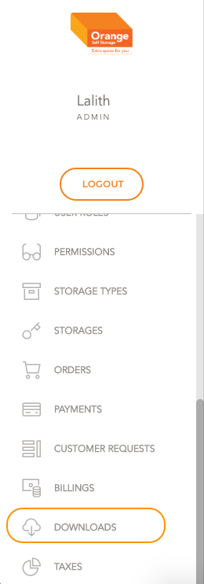
  
  # List
  
  - **User Lands on the Downloads list page**

  - **This Table shows Downloadable forms and  breakup of how many documents are available**

  - **User can create a new Document Template by clicking on Create Document template method on the top right corner of the table**
  

   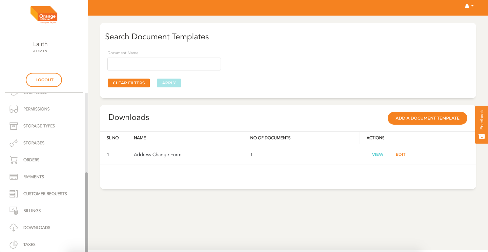
 
  # Create
  - **User Needs to fill out Document Template Name, description, roles to which this document is valid and documents associated with this Document**

  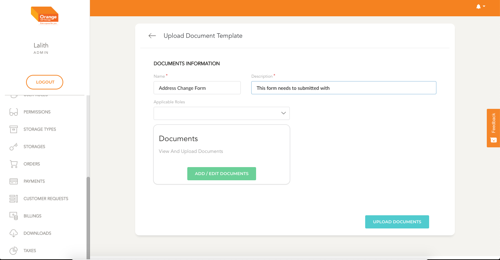
  

    **User can click on the User Roles Dropdown and select all applicable roles**
  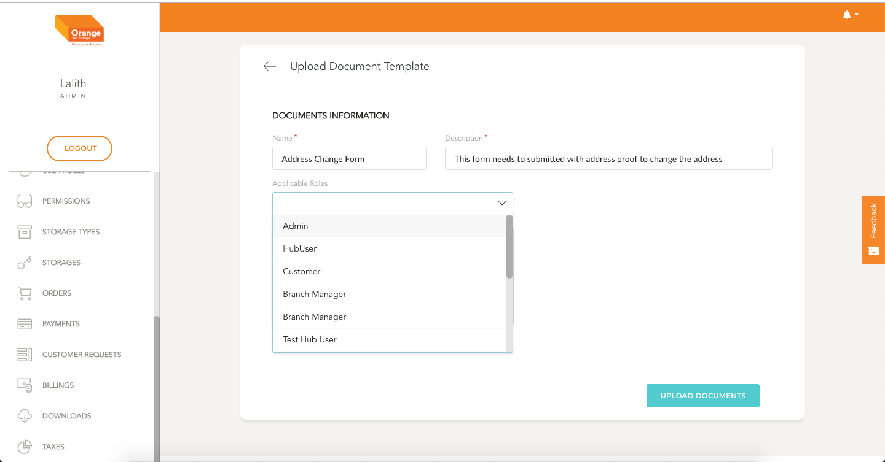
  

  
  **User can click ADD/EDIT DOCUMENTS to add files** 

       
  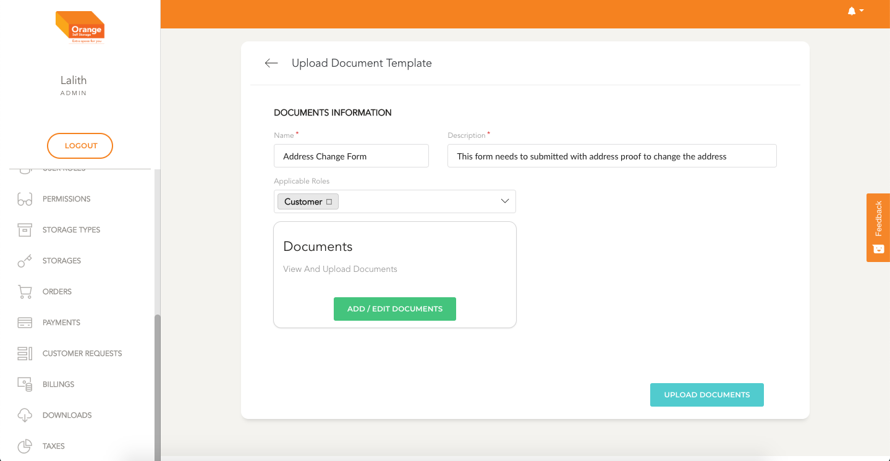

  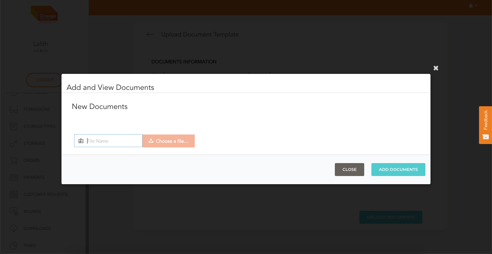

  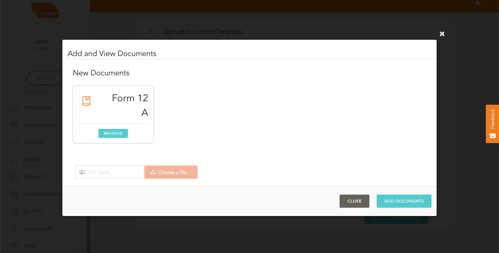

  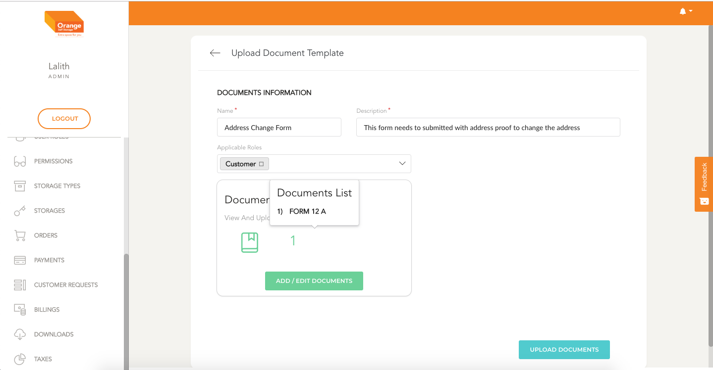

  **Once the files are selected click on the create button to create a new Document Template**  
  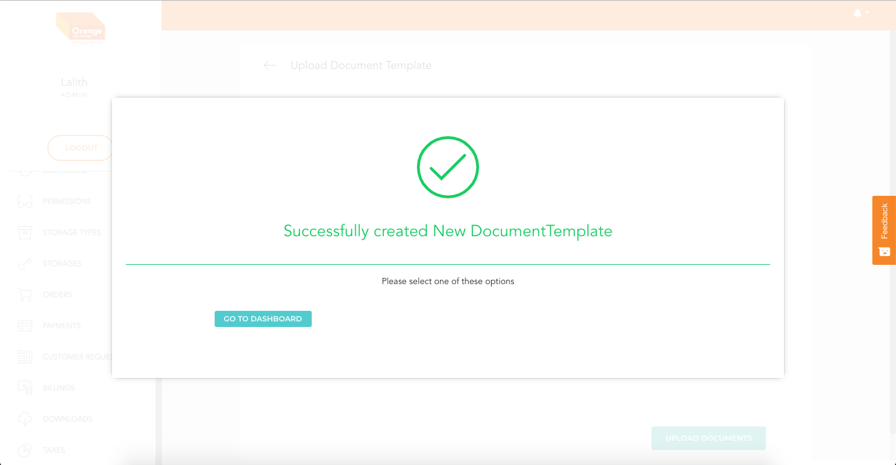

  # View   

  **User can select from the table and click on the View button**
  **User then taken to a page which looks like this**
    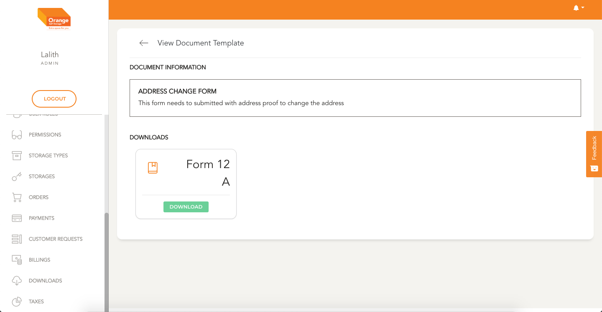

  # Edit   

  **User can select from the table and click on the Edit button** 
  **Once the page is loaded user make neccessary changes and update the document template**   

  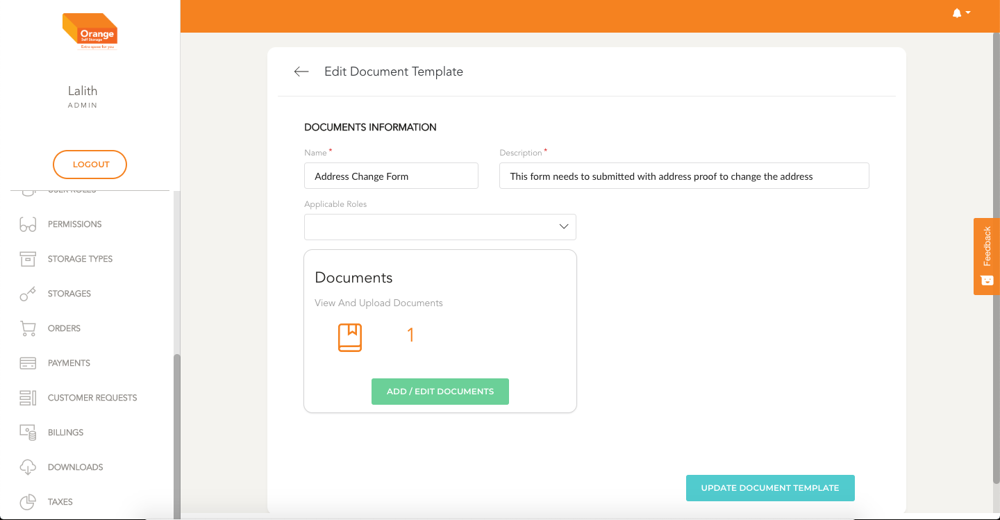
  