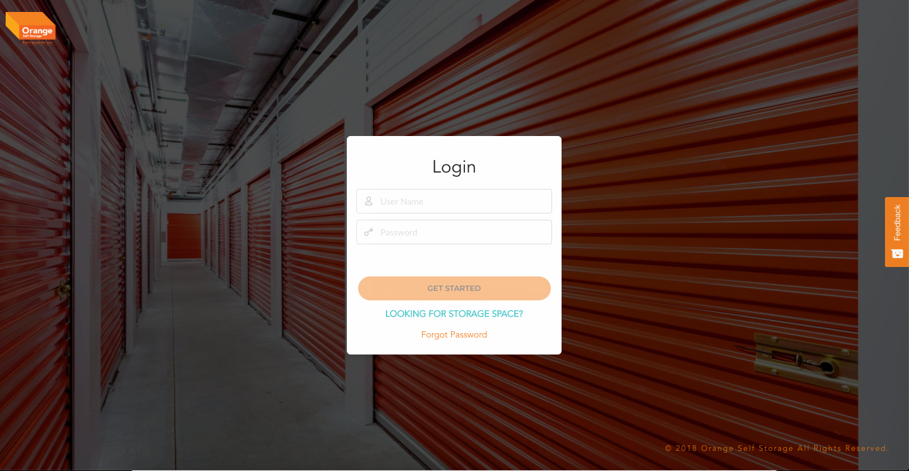
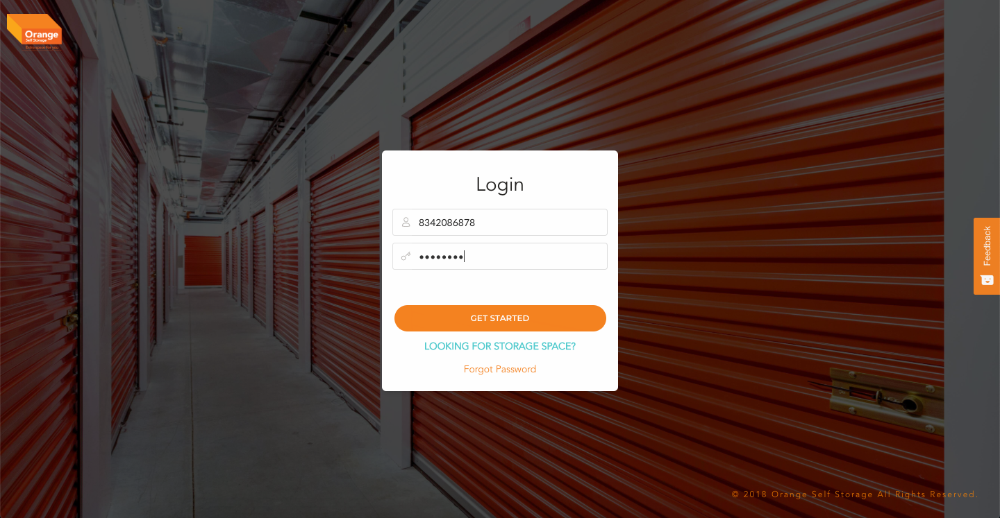
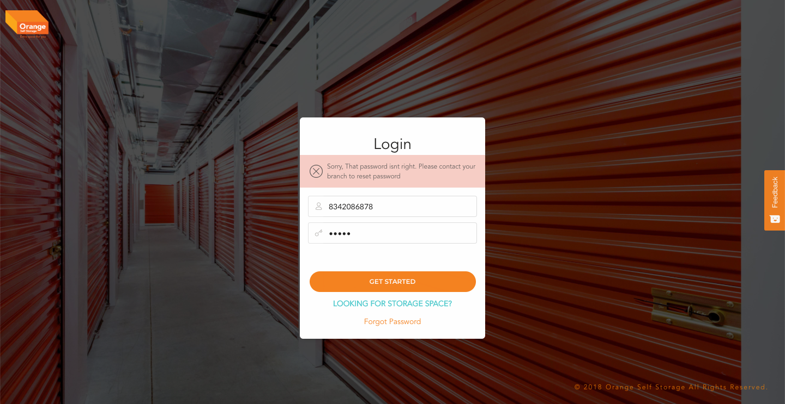
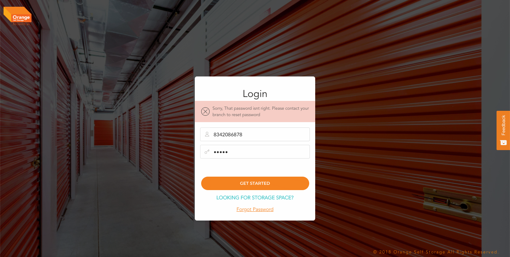
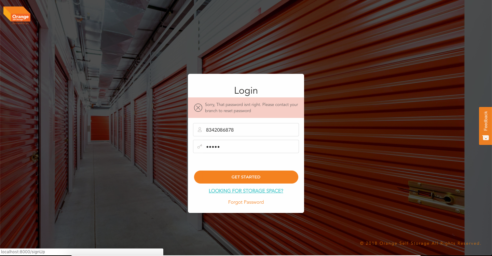

# Login

-**This is the Entry point to the application**

  - User can login into the portal
  - In case the User has forgotten the password they can use this page to request a new one
  - Potential customer can reach out to the office requesting availability of storages
  [Clicking here to go Login Page.](https://portal.orangeselfstorage.com/login)

-**This is the landing page of the Aplication**
 -
 -**Login Form has to filled with appropriate Login Username and Password**
 -
  -**If the user credentials are wrong the user is shown with this error message**
  -**User can either retry or request for a new password by clcking on `Forgot Password`**
 -
  -**This is the landing page of the Aplication**
 -
  -**User can click on `Looking for storage space` if they wish to contact the organisation for a new storage related query**
 -