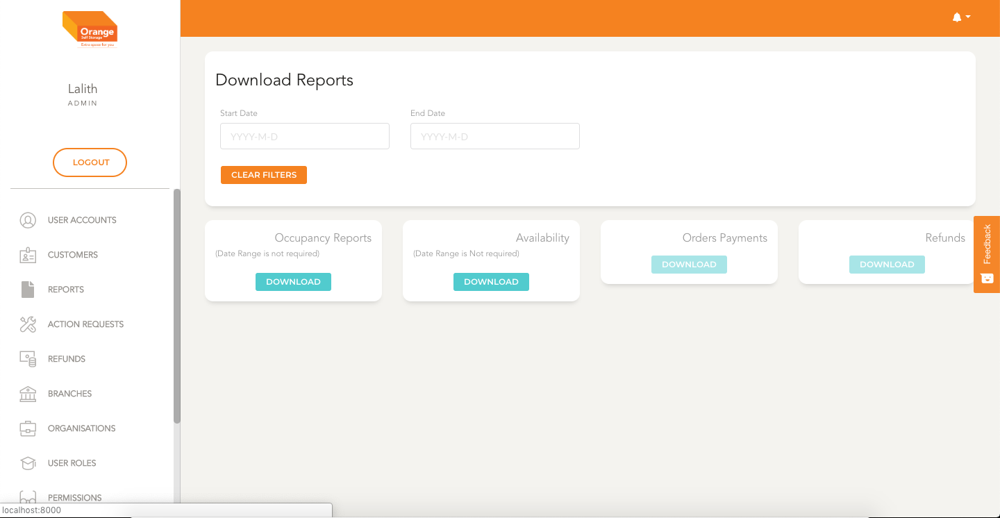
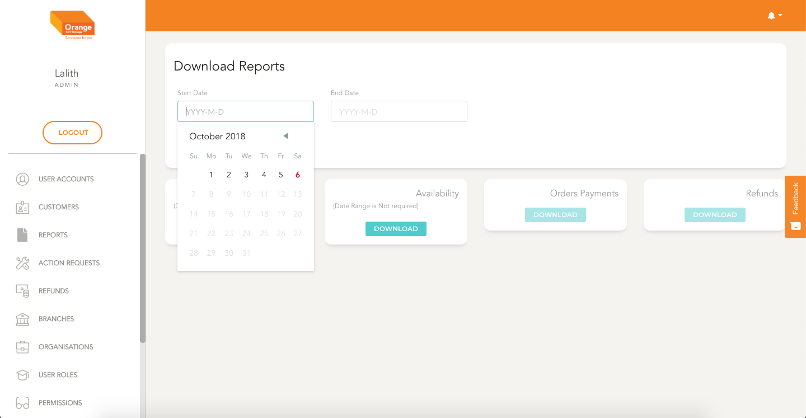
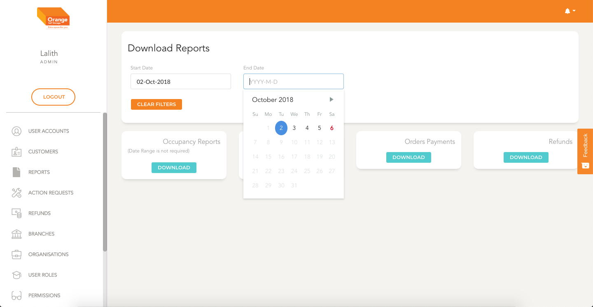

# Reports 

  **This Module can be used to download the following reports in xlsx format**

  - Occupancy Report
  - Storage Availabilty Report
  - Order Payment Report
  - Refunds Report

  
  [Clicking here to go to reports page.](https://portal.orangeselfstorage.com/reports)

  At first the user lands on the page and user can select one of the reports and click download button associated with each tile to download the report.

 - **Occupancy Report & Storage Availabilty Report** are independant of the dates
 - **Order Payment Report & Refunds Report** requires date range to download the reports
  

  
  

  - **User can select the start date by clicking on the start date input**

  
  

  - **User can select the end date by clicking on the end date input. Selecting start date is mandatory for selecting end date**
  
  

  
