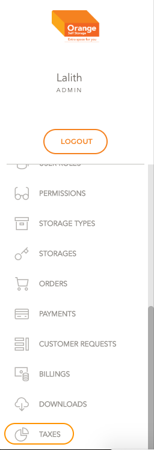
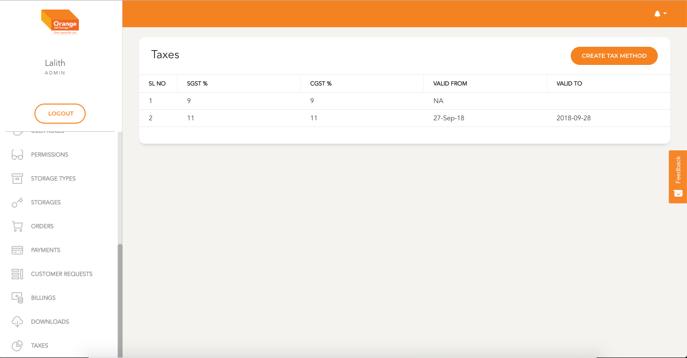
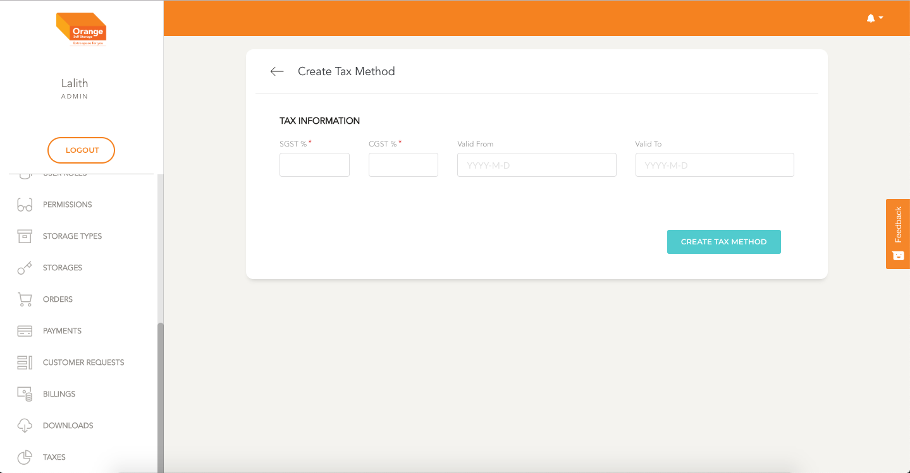
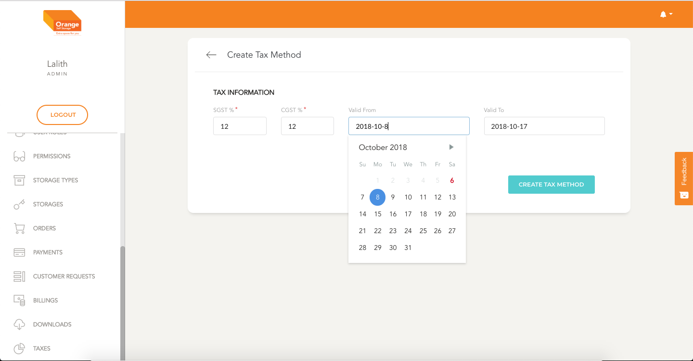

# Tax Module

  **This Module can be used to create and View Taxes**

  - Most Governments update tax structures for business entities time to time this module will help us set tax values for the transactions in orange self storage.

  
  [Clicking here to go to Taxes List page.](https://portal.orangeselfstorage.com/tax/list)

  [Clicking here to go to Create Tax Method](https://portal.orangeselfstorage.com/tax/create)

 The User can click on Taxes link in the side menu to access the taxes List page

  

  # List
   - **User Lands on the taxes list page**
  - This Table shows tax breakup and the validity dates of the tax

   

  # Create

  > If the dates aren't specified the system takes it as the default tax method

  - **User can create a new Tax method by clicking on Create Tax method on the top right corner**

  

  - **All the fields can be filled and click on the create tax button to create a new tax method**
  
  
