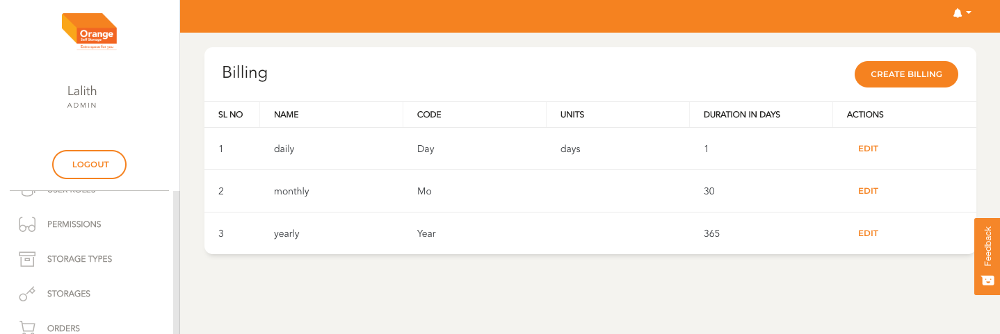
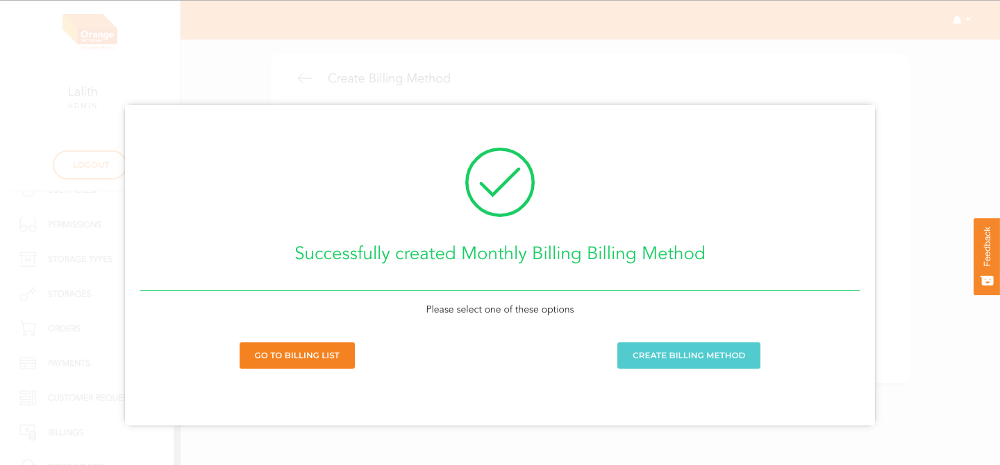

# Billing Module
  
  - Post Login the user is redirected to this page
  - Organisation Users see tiles with inforamtion regarding Hubs, Orders, Payments
  - The side menu changes for every role based on the permissions of the user

# Billing Module Link
- User with Permission to access Billing Module will see it in the side Navbar
- To Go to the module User can click on `Billings`
- Users with permission to create a new billing method can do by clicking on `Create Billing` on Top right corner of the table

 -

# List
- in Bills List Module User can view Name, Code, Units and Duration in days
- User can edit an individual Billing by clicking `Edit`

 -

# Create
- Users can create a new billing method by navigating to the create billing page
- Filling in all necessary details like Name, Code, Duration in Days, Units.
- Once all the neccessary Details are filled user can click `Create Billing Method`

 -

 -

 -

# Edit
- Users can view and edit a billing method by navigating to the edit billing page by clicking `Edit` in the billing Table
- Modify details like Name, Code, Duration in Days, Units.
- Once all the neccessary Details are modifies user can click `Apply Changes`

 -

 -

