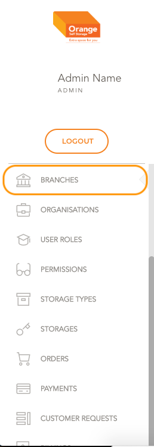
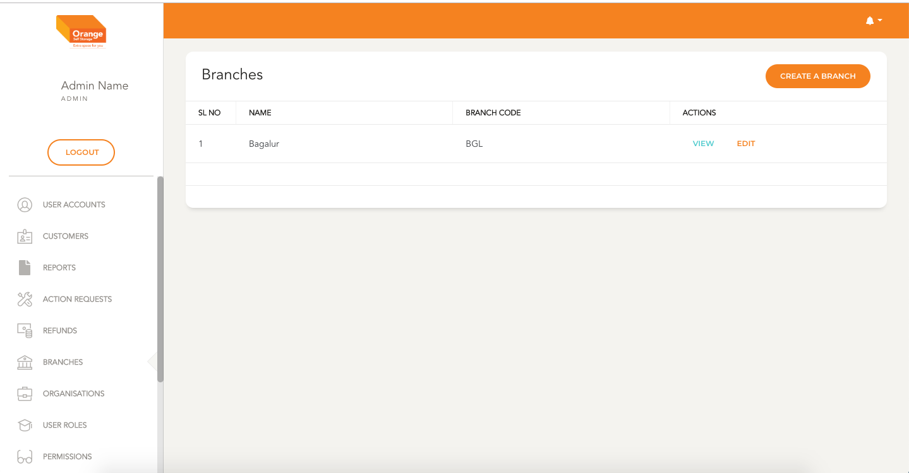
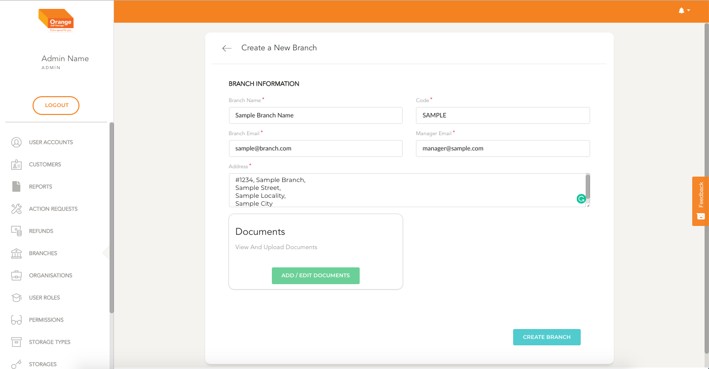
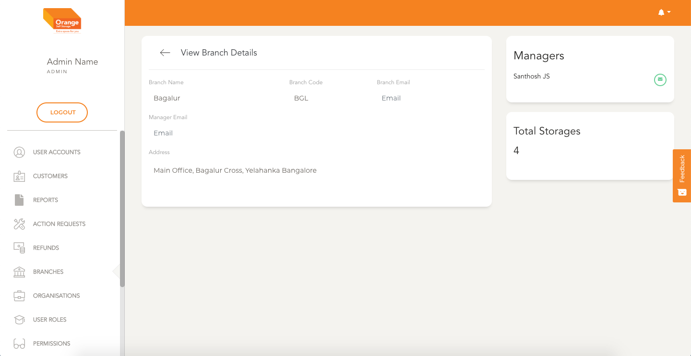
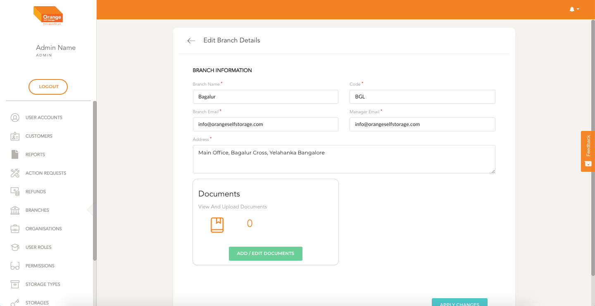

# Branch Management

- Users can view all the branches in the system
- New Branches can be added
- Existing Branches can be modifies

**This Module can be accessed by clicking on `Branches` in the side navigation Bar**
-

# List

- All the Branches are listed here in a alphabetical order
- Details like the branch name, code can be viewed from the list
- User can view the details clicking `View`
- User can edit the details clicking `edit`
-

# Create

- User can create  Branch  by clicking `Create A Branch` from the table
- User can create the branch by typing in name, Address, code, mail addresses of office and manager

**Create the Branch Details**
-

# View

- User can view a Branch in detail by clicking `View` from the table
- User can view the branch name, Address, code, mail addresses of office and manager
- User can view All the branch Managers associated with branch
- User can see the total storages available for a branch
**View the Branch Details**
-

# Edit

- User can edit Branch in detail by clicking `Edit` from the table
- User can edit the branch name, Address, code, mail addresses of office and manager

**Edit the Branch Details**
-
