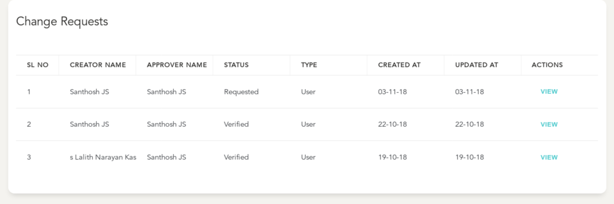

# Create

- User can create an Change Requests on Modules which Support this feature by clicking `Request Changes` from the Actions Menu in the Page

**Create Change Request**
- Select "Request Changes" in the module which you are requesting a change within, in this example, we are inside a User Account
-

  > In the Change Request form:
    -
    - Enter Details of the required changes and the reason for this change
    - Add in Any Supporting documents within the documents section - This works as described for the working of Document uploader in [Customers Creation Workflow](customers/create.md)
    - The Approval Task can be selectively assigned to a member filtered by the role and user name (optional)
    - Click on "Request Changes" to create this change request and raise it to either the branch manager or the selected User
    -

- On Successful Creation, You will get a confirmation Screen with navigation to the Concerned Entity
-

- The concerned Entity Page will now have a `Listing Section` as "**Change Requests**" available at it's details page
-

- Details of Accessing the listing and filtering of these requests can be found at the [Listing Page](changes/index.md)

**[Next Section](changes/details.md) Deals with the various actions that can be taken towards this request**
