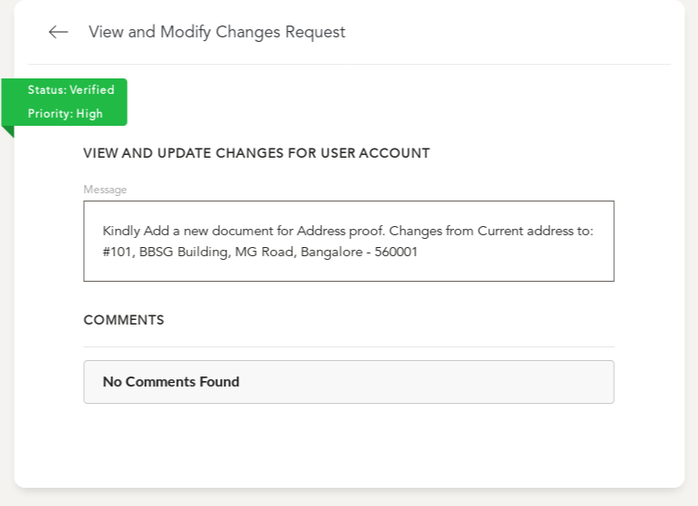

# Change Request Management

**This Page is used for the approval process of a change request**

- You will reach this page via one of the [Listing Pages](changes/index.md)
- Once in the Details page of the Change Request, you will be presented with all details of this change request

## Overview of Details Page:

-

> In the Section of an Action request for any entity:
  - Current Status and Priority of the Action Request
  - Details of the Request Made
  - Any Comments / Reviews
  - Options which can be modified 
  - Relevant Documents for the Request
  - Actions to take on this Action Request
    1. Rejecting A Request
    2. Modifying A Request
    3. Accepting A Request

### 1. Rejection Workflow:

-

- There maybe requests raised with insufficient data or invalid content, in such a case, the request is discarded via a `Reject Request` Action
- It is recommended but optional to add a comment when a Request is rejected by a user
- Optionally, the request can be modified / reassigned
- Once the Request is **Rejected** it is no longer available for editing
-

### 2. Modification Workflow:

-

- There maybe requests raised with insufficient data or invalid content, in such a case, the following changes can be made:
  - Change of Assignee based on User Role
  - Change of Priority - Escalation of the Request
  - Addition of Documents for the Request
  - Addition of details / comments by the handlers 
- Once the Request is **Modified** the changed values of Priority and Assignments are saved
-

### 2. Accept Workflow:

- Accept workflow Involves multiple Steps:
  1. Accepting the Change Request

  2. Making the required Changes to the data record

  3. Verifying the Changes to the Data Record

#### 2.1 Accepting a Change Request

- When All details of a change request are verified, it can be accepted

- Accepting a Request opens the Entity for editing
- Once Accepted, the Change Request is not retractable back to another status

**On Accepting the Change Request, additional sections are available in the details page**

> In the Section of an Action request for any entity: User Account in this case
  - Details of the Request Made
  - The entire conversation History
  - Edit Form for the Concerned Entity (User Account in this case)

#### 2.2 Making Necessary Changes

- When an Action Request is accepted, the Entity Edit form is available
- All changes made are recorded against the Action Request raised
- Necessary Changes can be made and then `Apply Changes` is the Action to Proceed to the next step

- On no validation errors to the form, you will get a confirmation screen with Navigation to the Concerned entity

#### 2.3 Verifying Necessary Changes

**On Applying the changes, the added changes are available in the Entity details page (User Account in this case)**

- Action Request is now in an "Completed" Status

- All Changes made are committed to the Entity and Available for further editing before Validation is complete
- The Validating User can make changes to any errors/faults that may have been made during the edit here
- If All changes are good to go, the bottom of the Action Request Details now has a single action of `Verify Request` which needs to be Clicked

- This will Complete the Change Request workflow and the requested changes will now be finalized and available in the concerned Entity (User Account in this case)

> Once the Verification is complete for a Change Request, The Action request is **no longer editable in any manner** and further changes require a new Change Request to be raised
  - The completed Status and entiry conversation history / change history and set of changes are available under details
  - 
