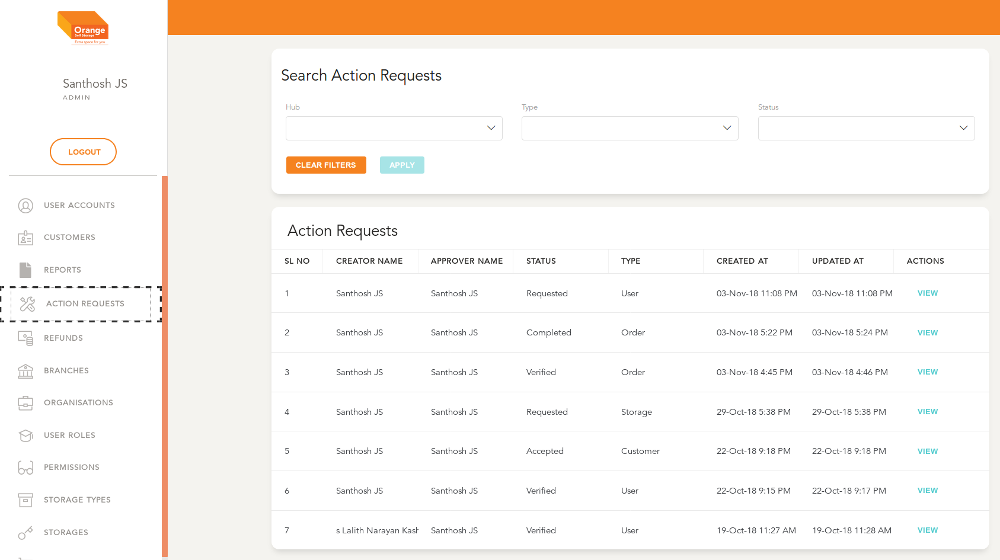

# Change Requests / Action Requests Module

- Users can create, view and manage Action Requests

**This Module can be accessed by clicking on `Action Requests` in the side navigation Bar or by visiting any Entity with Change Requests Enabled**

## 1. When Accessed via Sidebar menu

- All the Action Requests are listed here in a chronological order 
- Along listing are details of requester, The concerned entity (User / Customer / Order etc), Status and timings 
- User can view the details / Carry out further Actions by clicking `View`
- The list can be filtered by Branch, Status and Type of Entity
- Click `Apply` to view the filtered details
- To clear the applied filtered Click `clear Filters`

## 2. When Accessed via Entity Detail page

- All the Action Requests pertaining to the entity (User Account in this case) are listed here in a chronological order 
- Along listing are details of requester, The concerned entity (User / Customer / Order etc), Status and timings 
- User can view the details / Carry out further Actions by clicking `View`
