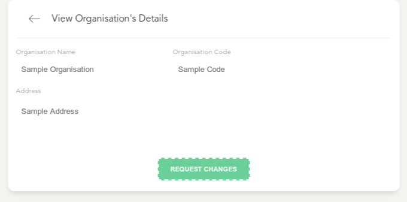
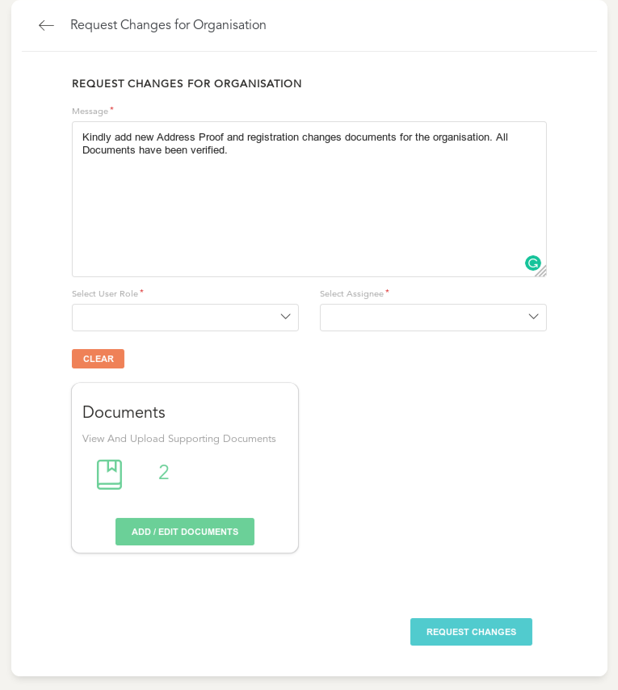

# Change Request For Organisations

- A Change Request for a Organisation can be Raised from the [Organisation Details](organisations/view.md) page by clicking on the `Request Changes` Action

- Once in the Details page of the Organisation Change Request, you will be presented with all details of this Change Request
  
> In the Change Request form:
  -
  - Enter Details of the required changes to the Organisation
  - Add in Any Supporting documents within the documents section - This works as described for the working of Document uploader in [Customers Creation Workflow](customers/create.md)
  - The Approval Task can be selectively assigned to a member filtered by the role and user name (optional)
  - Click on "Request Changes" to create this change request and raise it to either the branch manager or the selected User
  -

- Details of Accessing the listing and filtering of these requests can be found at the [Listing Page](changes/index.md)

**[Next Section](changes/details.md) Deals with the various actions that can be taken towards this request**
