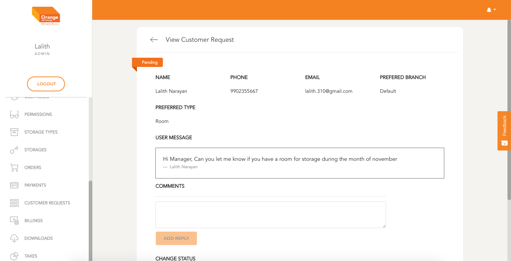

# Sign up - using Customer Requests Management

- User can request for storages from Signup screen
- All the requests are shown here
- Requests can be tracked and can be brought to conclusion

**This Module can be accessed by clicking on `Customer Requests` in the side navigation Bar**
-

# List

- All the Customer Requests are listed here in a chronological order
- All the requests are shown here ex Customer Name, Phone, Email
- User can view the details and modify by clicking `View`
- The list can be filtered by branch and storage type by changing inputs in the top bar
- Click `Apply` to view the filtered details
- To clear the applied filtered Click `clear Filters`

# View/Edit

- User can view a customer request in detail by clicking `View` from the table
- Users can view customer request details, can comment and change the status of request 

**View the Customer Request Details**
-

**Add a comment to this request by typing in the comment and clicking `Add Reply`**

-

**Status of the request can be changed this can be saved by clicking `Apply Changes`**

-
