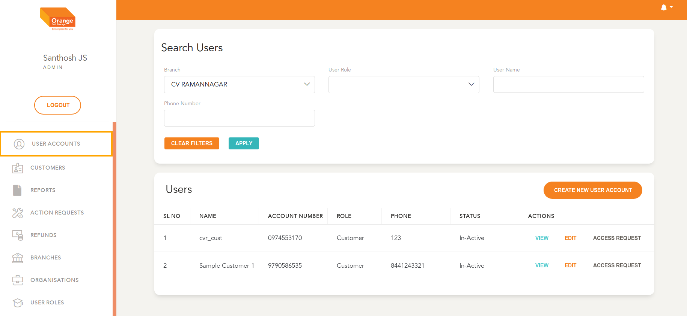

## Phase 2: Activate Customer Account (after verification)

#### Prerequisites:
  - Customer has been created as a `Primary Customer`

# User Listing/Filter/Search
  **This Module can be accessed by clicking on `User Accounts` in the side navigation Bar**
  -

  - Filter Users by User Role as `Customer` and the correct Hub
  -  

  - All user Accounts are available here as per the selected filters and chronologically ordered
  - User can view the details and modify by clicking `View`
  -    

  - Before the User can login, the account need to be activated
  - To Activate Account, with the correct permissions assigned to the current user, Click `Approve Account`
  -  

