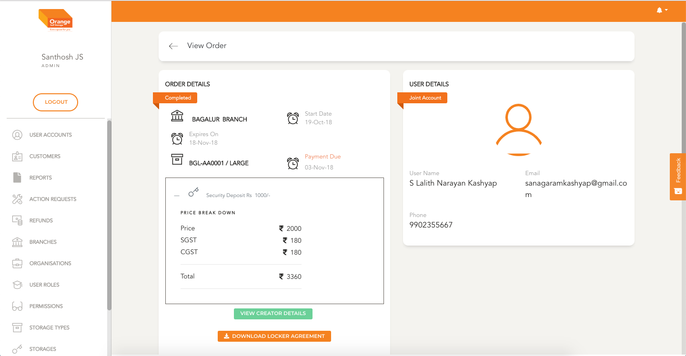
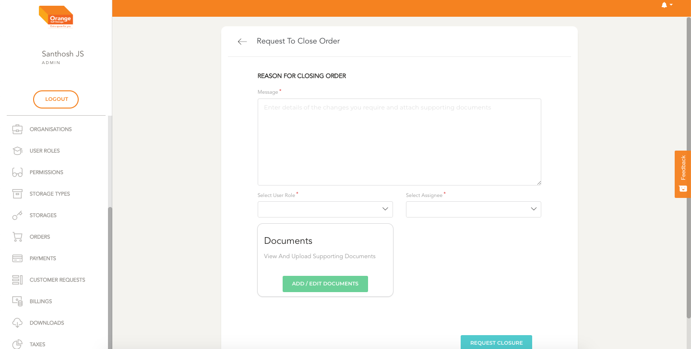

# Close Request For Order

- User can raise a request to close order by clicking `Close Order` in the view page

**View the Order Details**
-
 
 
 
 

- In textarea User can type the message regarding why the order needs to be closed
- If the User has permissions they can assign the request to a person or change the priority of this request.

**Close Request Screen for Order**
-
 