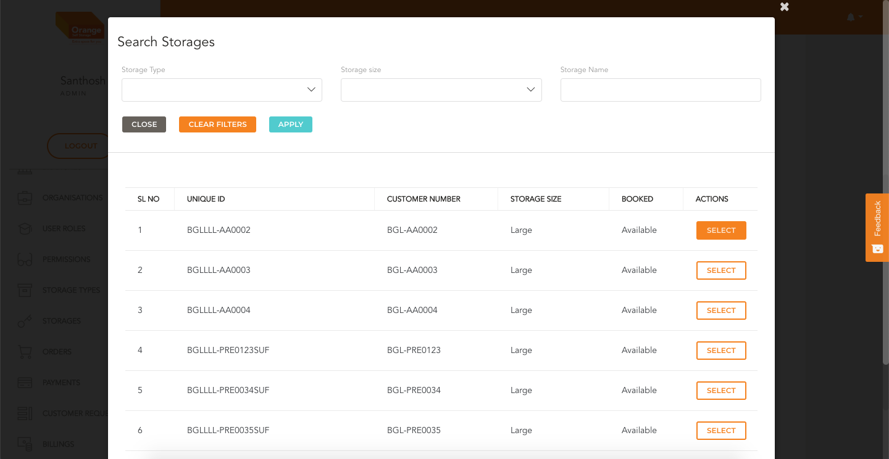

# Create

- User can create  Order  by clicking `Create An Order` from the table in `Order List View`

*Create the Order*
-

# Steps To Create Order

- Select Branch for Which order is being created
- Click `Add User` to add the User for whom order is being placed
-
- In the `Add User Page` Filter the user by searching by Name or Phone Number

- Click on the `Add` and Click `Add User to Order`;
-

- Next Select the Storage
- Click on `Add/ Edit Storage` 
- Search for the requisite storage and click `Select`
-

- Select `Storage Price`
- Fill `Min Billing Period`
- Enter the `Security Deposit` and Description of the security deposit
- Click `Add Storage to Order`
- On the date picker select the date from which the order is to be started
-

- Click on `Create Order`

 
 

*View the Order Details*

-

 