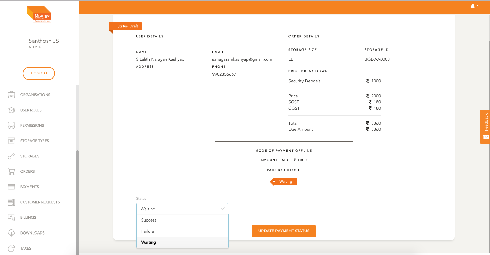

# Edit payment

- This is applicable in case of offline payments
- Suppose a user pays by cheque the offline payment is created with a status of `Waiting`
- Once the cheque is passed the status of payment can be changed to `Success` or `Failure`

**STEPS TO Edit Payment**
- Go to payment list view
- Select Options to change `Status`
- Select a appropriate status
- click `Update Payment Status`

-
 
 

