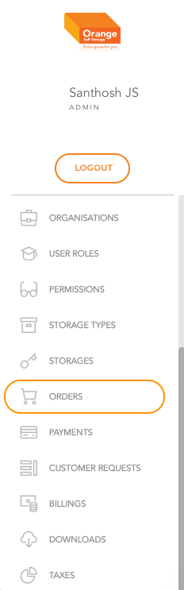
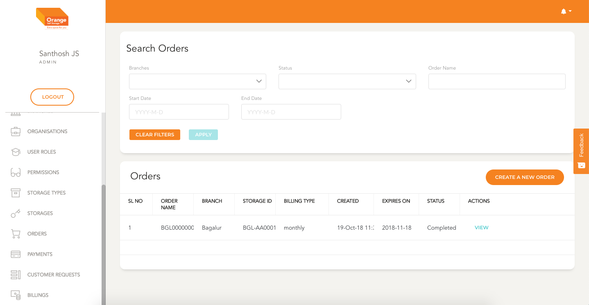
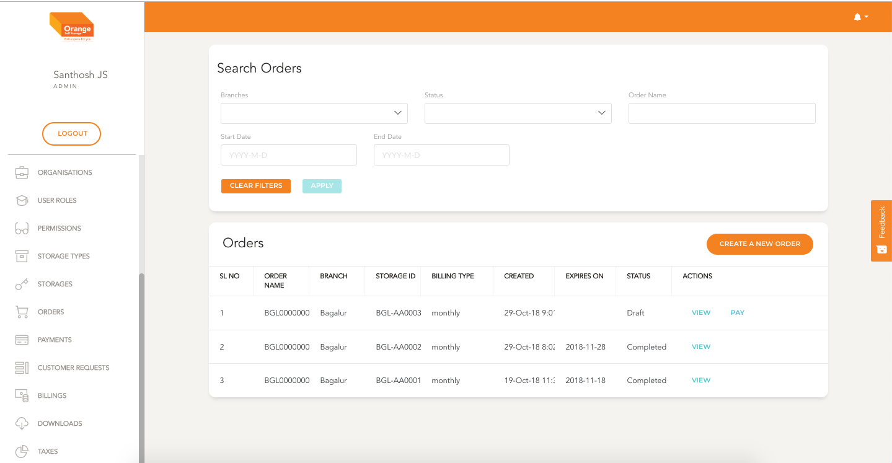

# Order Module

- Users can create, view and pay for order in this module

**This Module can be accessed by clicking on `Orders` in the side navigation Bar**

# List

- All the Orders are listed here in a chronological order
- Orders are listed with their number, branch, Storage ID, Billing Type, creation date, Expiry Date, Status
- User can view the details by clicking `View`
- The list can be filtered by Branch, Status, Order Number and date range
- Click `Apply` to view the filtered details
- To clear the applied filtered Click `clear Filters`

