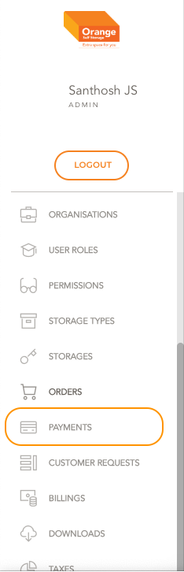
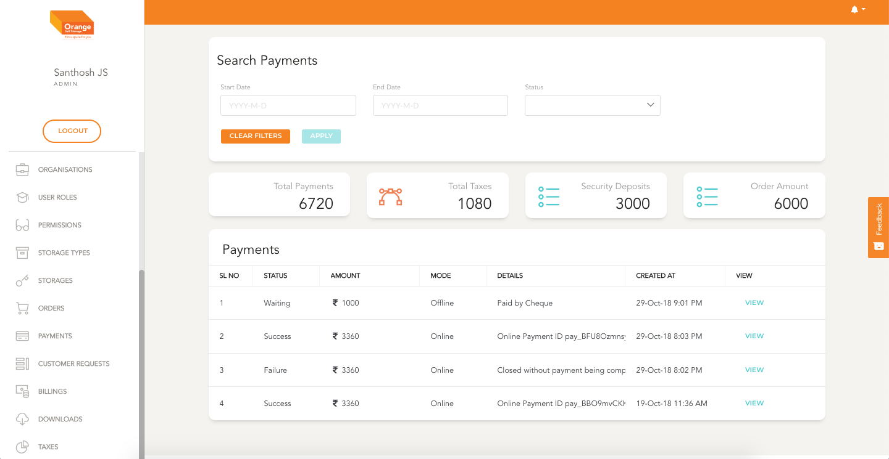

# Payment List

- Users can view all payments list with this module

**This Module can be accessed by clicking on `Payments` in the side navigation Bar**
-

# List

- All the Payments are listed here in a chronological order
- Payments are listed with their number, Mode, Details, creation date and Status
- User can view the details by clicking `View`
- The list can be filtered by Start Date, End Date and Status 
- Click `Apply` to view the filtered details
- To clear the applied filtered Click `clear Filters`
-
