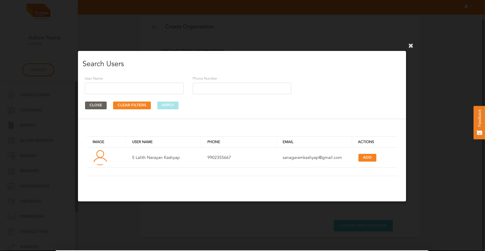

# Create

- User can create an organisation account by clicking `Create an Organisation` from the table

**Create the Organisation Details**
- Click on Add/Edit User to link User accounts to Organisation
-

**Add User Popup**
-

**Create the Organisation Details**
- Users can be filtered by searching using name or phone number or both. 
- Clicking on `Apply Filters` gets the filtered list of users
- Clicking on `Clear`clears the filters applied
- Click on `Add` against the user you want to add to the Organisation Account

-

**Selecting Primary User**
- Adding a primary User for an Organisation is a must
- Go to the user card and click on primary user radio to check uncheck
- After adding all related user accounts click on `Add Users to Organisation`
-
