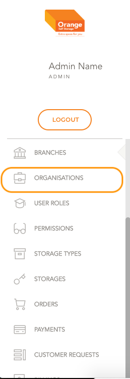
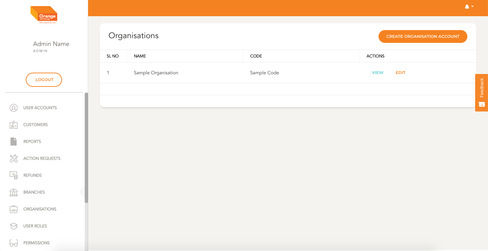

# Organisation Management

- Organisation account is a feature we have to allot storages to an organisation. We can create an organisation account and assign a primary user to this account. The primary user is the authorised signatory

**This Module can be accessed by clicking on `Organisations` in the side navigation Bar**
-

# List

- All the Organisation Accounts are listed here in a alphabetical order
- Details like the branch name, code can be viewed from the list
- User can view the details clicking `View`
- User can edit the details clicking `edit`
-
