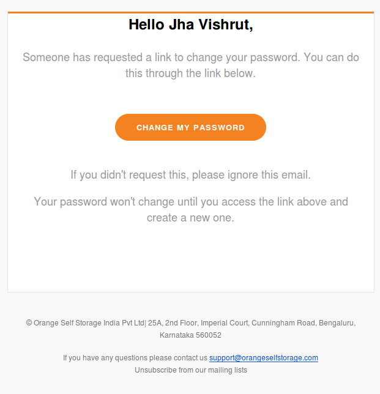
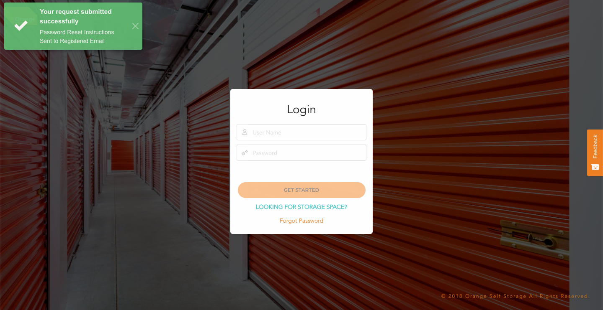
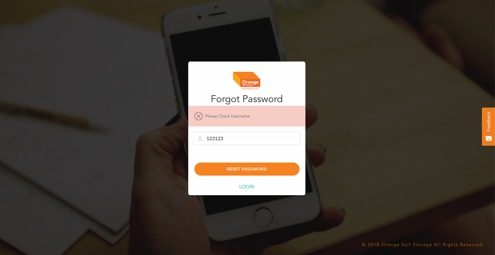

# Reset Password

**This is the Entry point to the application**

  - Reseting Password after the password reset mail
  - Once you have received the password reset mail:
  -

**If the username details are correct the user will see message like this**
  -

**If the username details are wrong the user is shown with an error message like this**
  -
