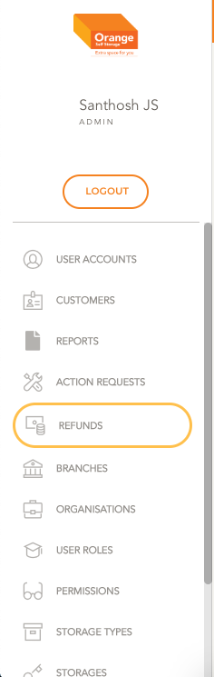
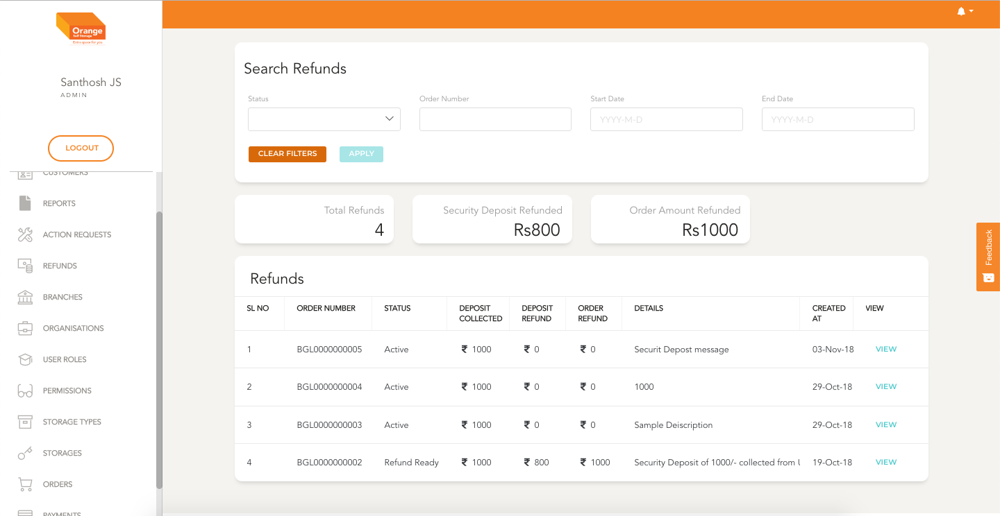
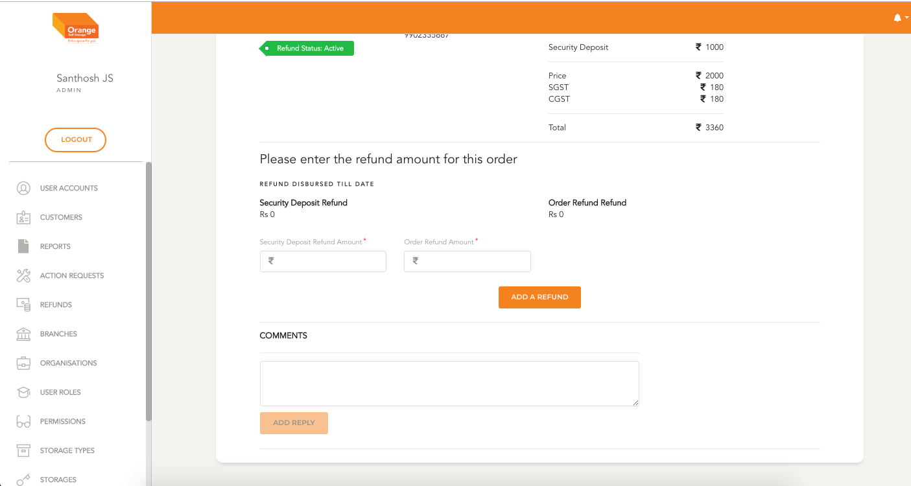
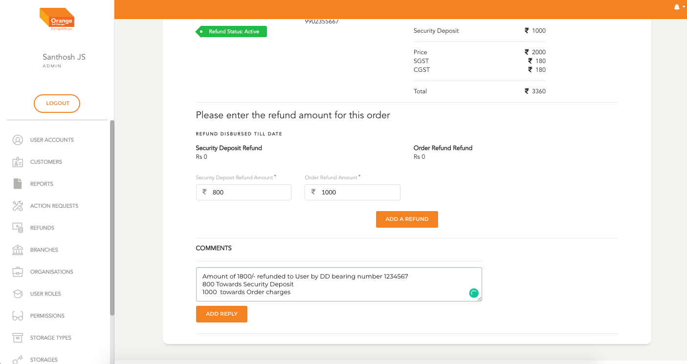
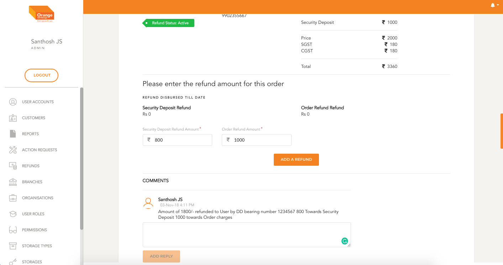

# Refunds Management

#### Prerequisites:
  - This Application can be used only to make an entry of the refunds initiated offline
  - Refunds can be made to orders for which payments have been made
  - Refunds can be made only for closed closed orders

# List
  **This Module can be accessed by clicking on `Refunds` in the side navigation Bar**
  
  
  -

  - All the Closed orders are listed in chronological order
  - All orders are listed with order Status, Order Number, Security Deposit Collected, Order Amount Refunded, security deposit refunded
  - The order details can be viewed by clicking `View`
  - The list can be filtered by Status, Order Number, Start and end date of the order
  - Click `Apply` to view the filtered details
  - To clear the applied filtered Click `clear Filters`

  -

# Initiate Refund
  **Please Note** 
  - Amount being refunded for Security Deposit can't be more than Security Deposit collected
  - Amount being refunded for Order Charges can't be more than base value of amount collected

  **This Module can be accessed by clicking on `View` on the refunds List Table**
  -
 
  - Click `View` to see order details
  - Enter amount refunded for security Deposit
  - Enter amount refunded for Order Charged
  - Once the amount is entered click `Add a Refund`
  - In the comment section add a message about the refund

  -
  -
  -
  -

