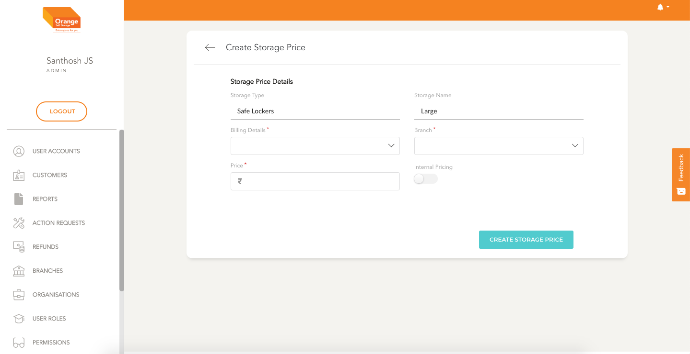

# Create

- User can create an Storage Price by clicking `Create Storage Price` from the `Storage Size Manage` Page

**Create Storage Price**
- In the form Fill details like the branch, billing type, Price and internal.
- Once the form is filled click on `Create Storage Price`
-
 

