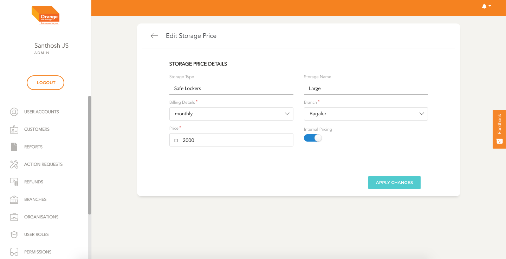

# Edit

- User can edit an Storage Price by clicking `Edit` from the `Storage Size Manage` Page

**Edit Storage Price**
- In the form edit details like the branch, billing type, Price and internal.
- Once the form is filled click on `Apply changes`
-
 

