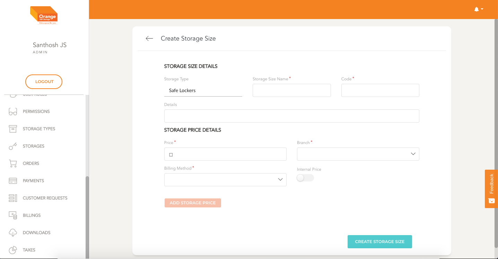
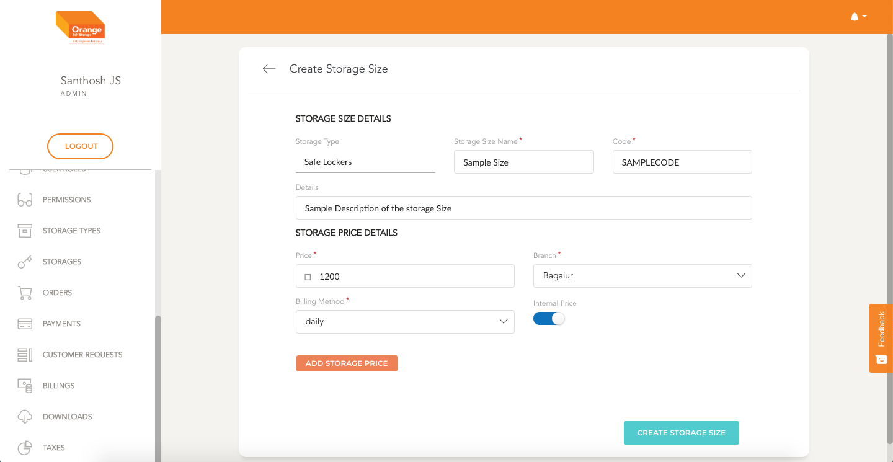
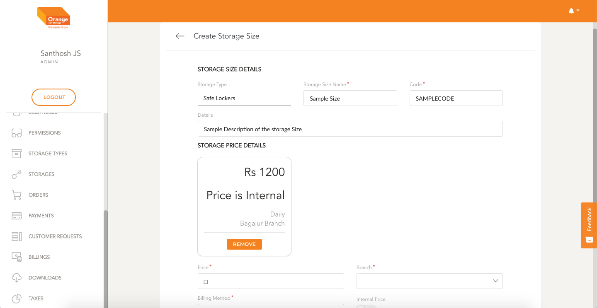

# Create

- User can create an Storage Size by clicking `Create Storage Size` from the `storage type Manage` Page

**Create Storage Size**
- In the form Fill details like the Name, code and details.
- You can also add storage Price linked with storage type by filling the necessary details and clicking `Add Storage Price`
- While creating storage price you can select if a price is internal or acessable to al. Internal Prices would be visible for Customers.
- Once the form is filled click on `Create Storage Size`

-
 
 
 
-
 
 
-

