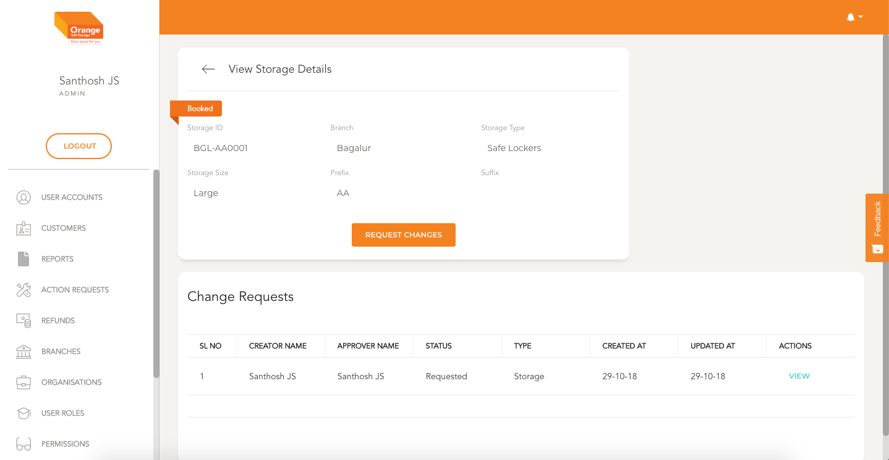
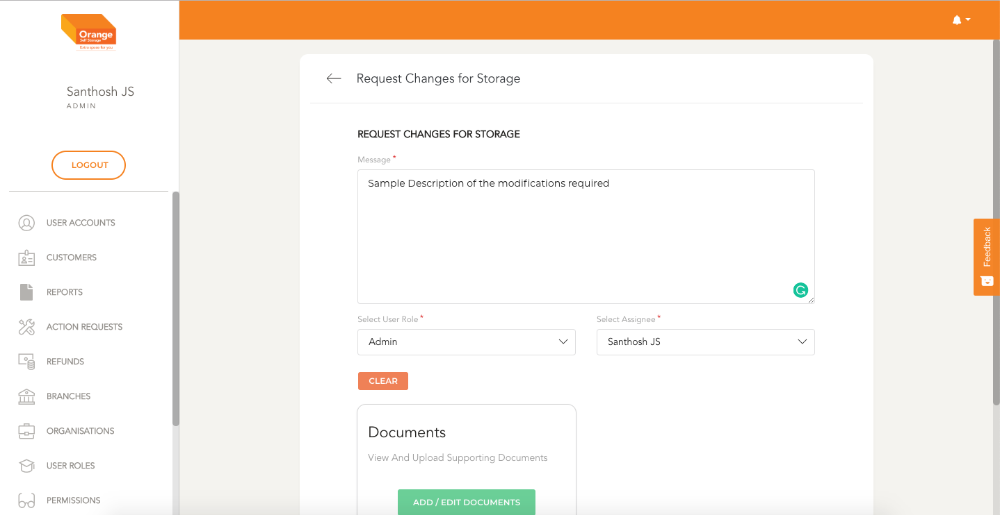

# Change Request For Storages

- User can raise a request to make changes in the Storages Account by clicking `Request Changes` in the view page

**View the Storages Details**
-
 
 
 
 

- In textarea User can type the message regarding what changes are to be made
- If the User has permissions they can assign the request to a person or change the priority of this request.

**Change Request Screen for Storages**
-
 