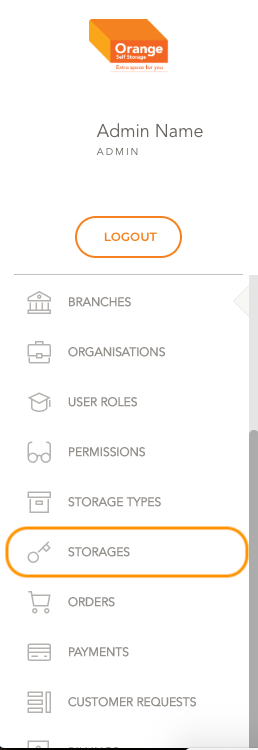
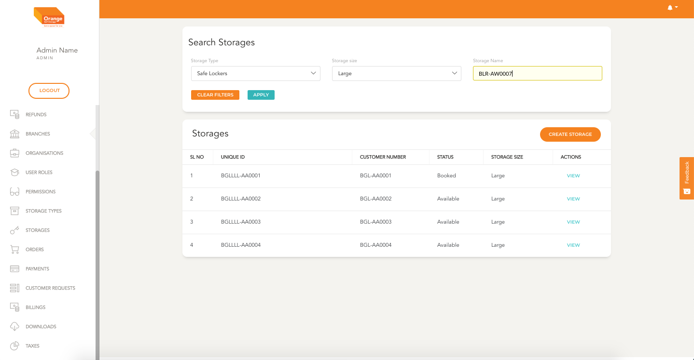
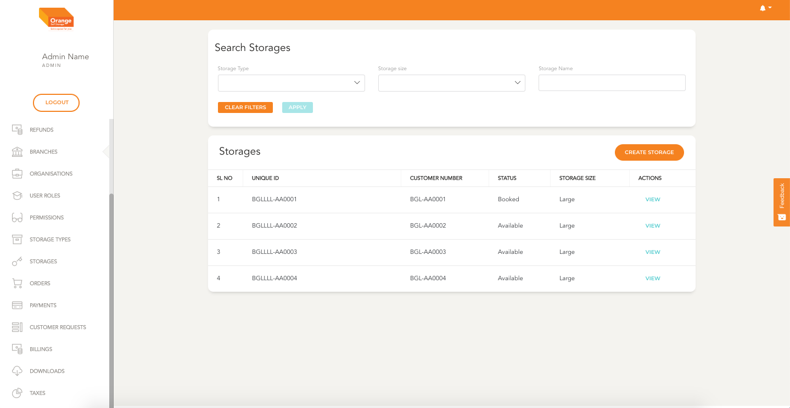

# Storage Management

- Storages are the various storages that are available in `Orange Self Storage`

**This Module can be accessed by clicking on `Storages` in the side navigation Bar**
-

# List

- All the Storage are listed here in a chronological order of its creation
- The storages table in list view shows details like the Unique ID, Storage ID, Status of the Storage and storage size
- User can view the details clicking `View`
-

- The list can be filtered by Storage Type,  Storage Name and Storage Size
- Click `Apply` to view the filtered details
- To clear the applied filtered Click `clear Filters`
-
