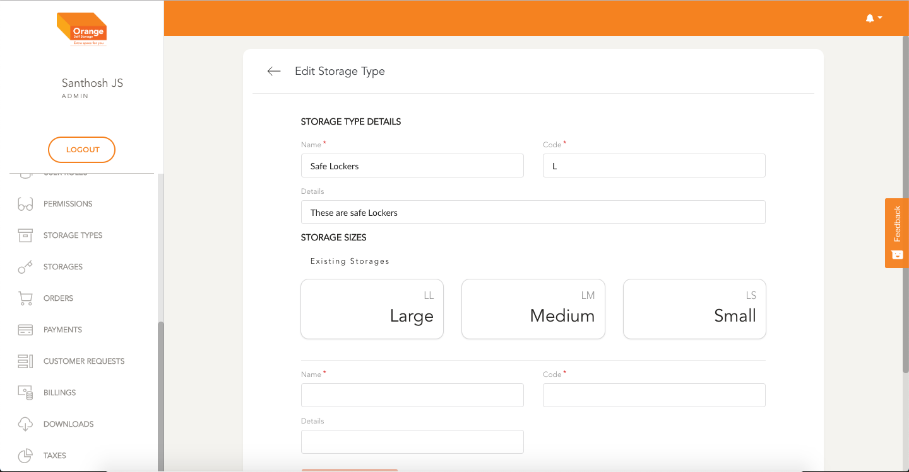
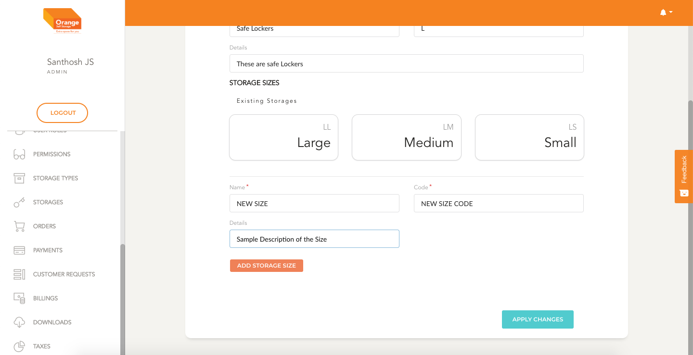

# Edit

- User can edit an Storage Type by clicking `Edit` from the table
- In the edit page, User can change the name, code and description
- User can add more storage Sizes but cannot delete existing Storage Sizes

**Edit Storage Type**
- In the form Fill details like the Name, code and details.
- You can also add storage Sizes linked with storage type by filling the necessary details and clicking `Add Storage Size`
- Once the form is filled click on `Create Storage Type`

-
 
 
 
-

