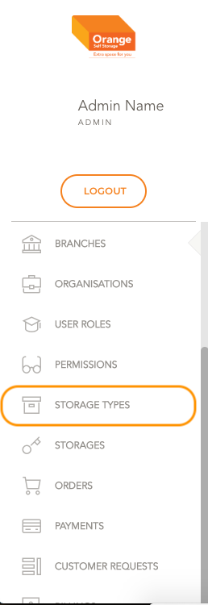
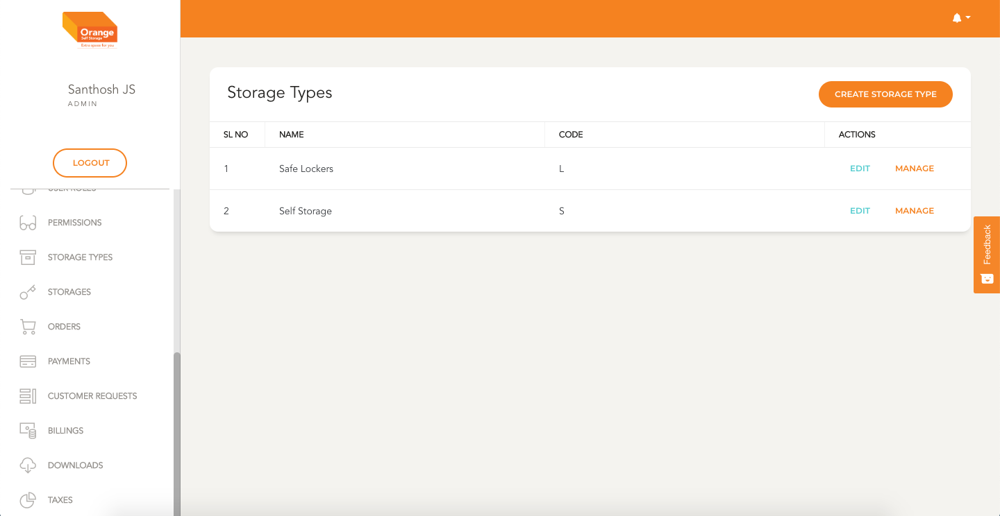
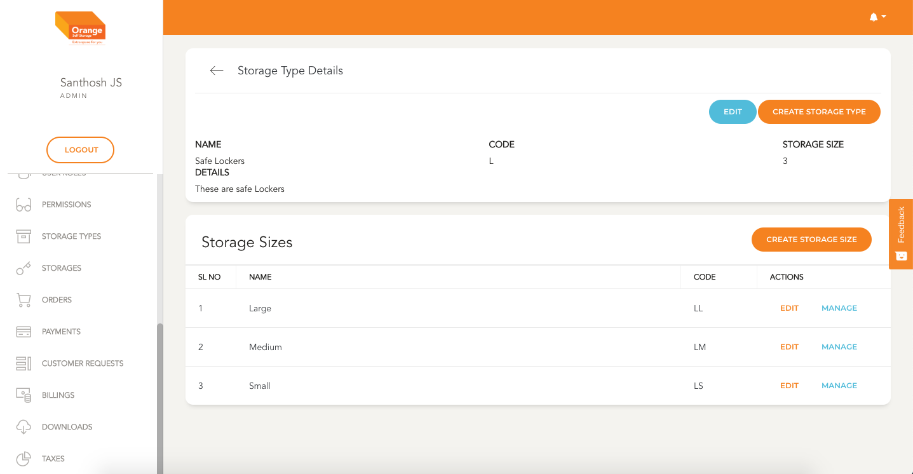

# Storage Type Module

- Storages Type are the various variations of storages that are available in `Orange Self Storage` self storage, Rooms for example

**This Module can be accessed by clicking on `Storage Types` in the side navigation Bar**
-

# List

- All the Storage Types are listed here in a chronological order of its creation
- The storages Types table in list view shows details like the Name and Code
-

# Manage

- Individually a storage type can be monitored by clicking `Manage` in the table
- Details of the storage Type can be seen and the list of storage Sizes associated with this type.
- This page can also be used to navigate to `Edit` Screen and to Create a `Storage Size`
-

 
 
