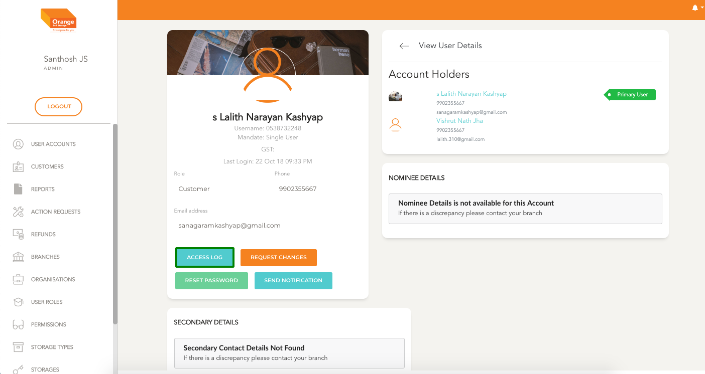
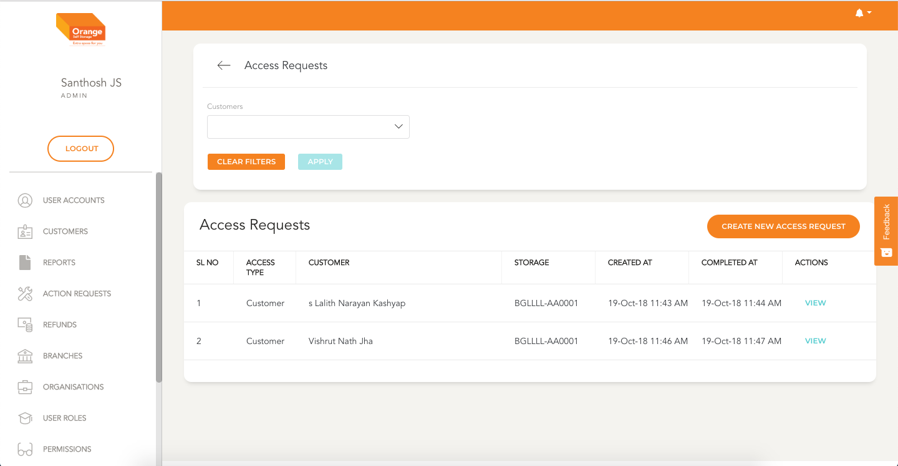
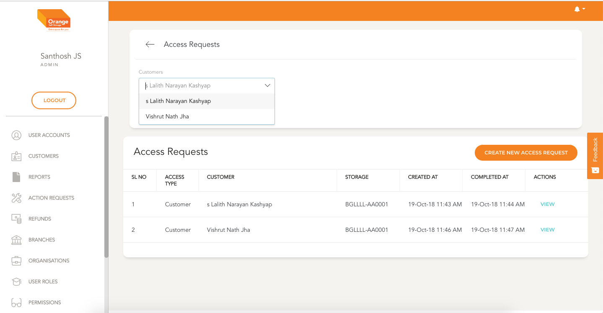
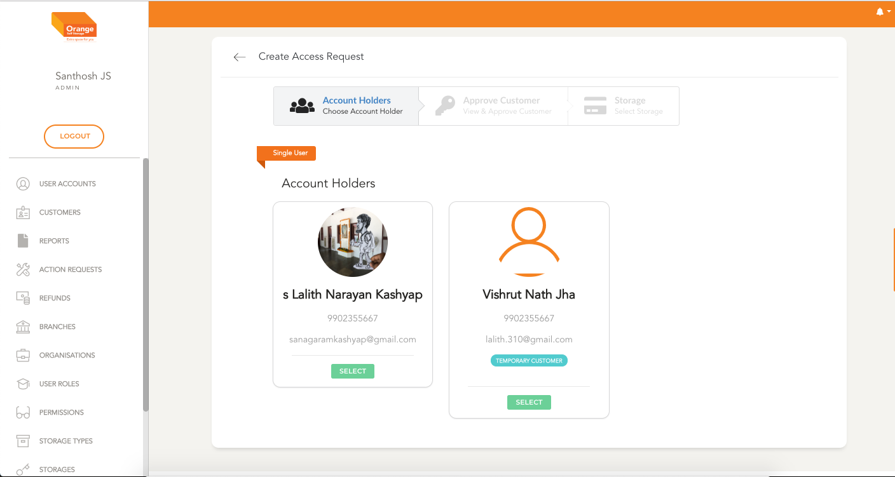
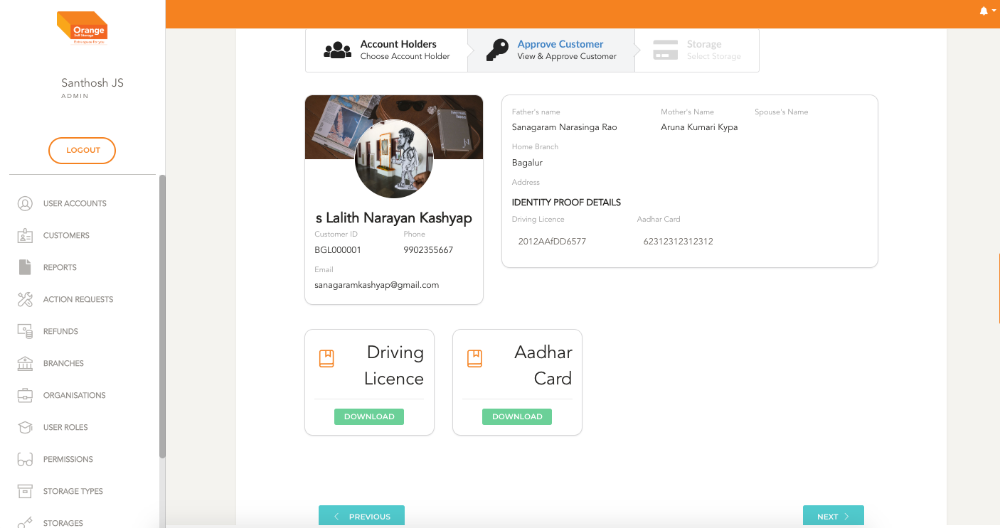
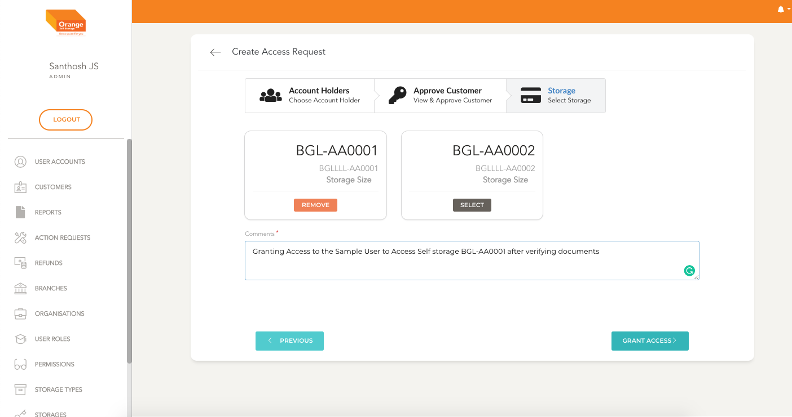
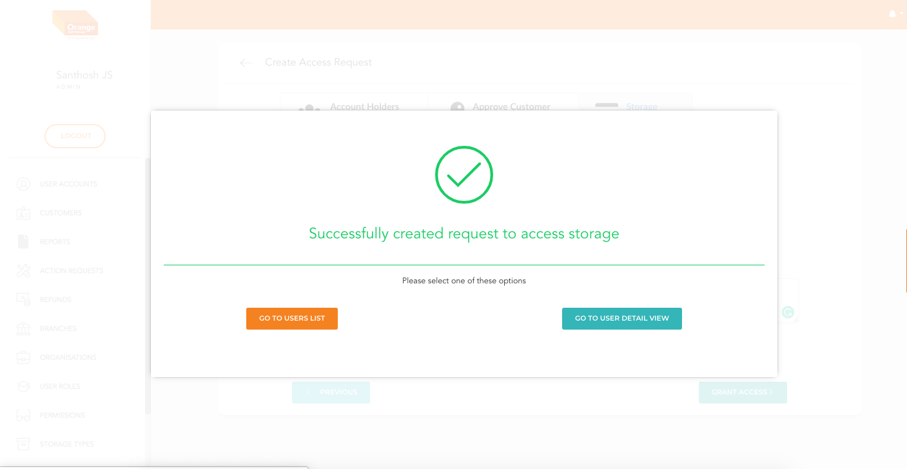
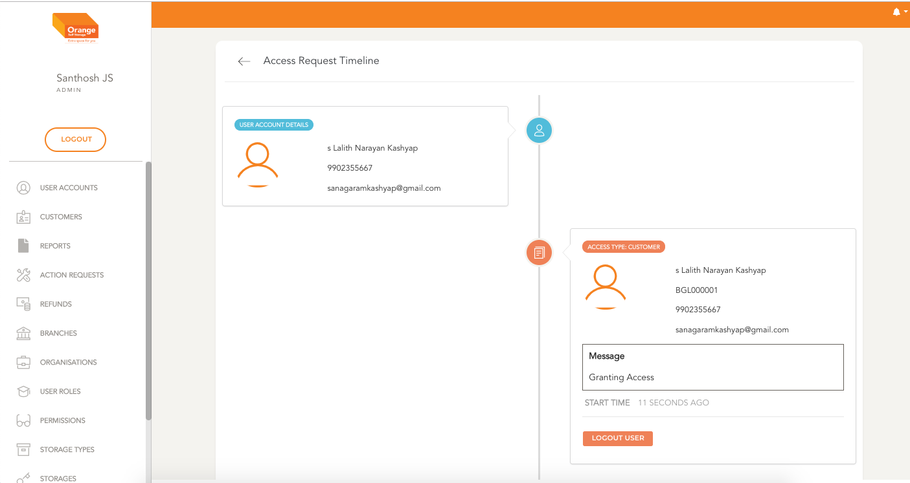
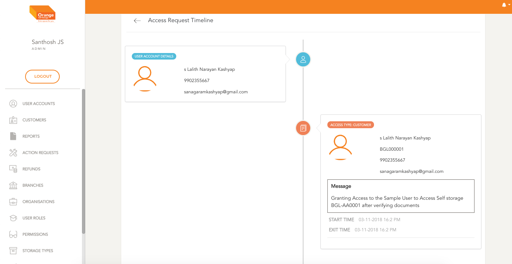

# Storage Access Management

  - Access Request is a feature to track storage usage by a user

# Create Access Request
**This Module can be accessed by clicking on `Access Request ` in the User Table**

-
**OR**
**Module can be accessed by clicking on `Access Log ` in the User View**

-
  

  - All the access made by the user are listed in Access List Page
  - All the Accesses are shown here ex Customer Name, Storage Number, Login And Logout Time
  - User can view the details and modify by clicking `View`
  - The list can be filtered by Customer
  - Click `Apply` to view the filtered details
  - To clear the applied filtered Click `clear Filters`

**Create An Access Request for a User**
  - On User Access Request List Page
  - Click on `Create New Access Request`
  - Hub User Can select the correct user
  - Click `Next`
  - Hub User can view and verify the customer details and ask a few questions to assertain customer's identity
  - Click `Next`
  - A Page with all active orders is shown. Select the storage which the customer wants to access
  - Fill in the details about the access information
  -

  

  

  

  

  

# Logout Access Request
  - Once the `Access Request` is created and the user finishes using his storage Customer needs to be logged out
  - Go to Access Request Details by clicking `View`
  - Click `Logout` to log the access out
  -
# View Access Request
  - Go to Access Request List Page
  - Go to Access Request Details by clicking `View`
  -
  
### Quick references:

  * [Create and Edit User](users/create.md)
  * [User Account Verification](users/userverification.md)
