## Phase 1: Enter User Account Details

  **This Module can be accessed by clicking on `Create New User Account` in the Action Items**
  -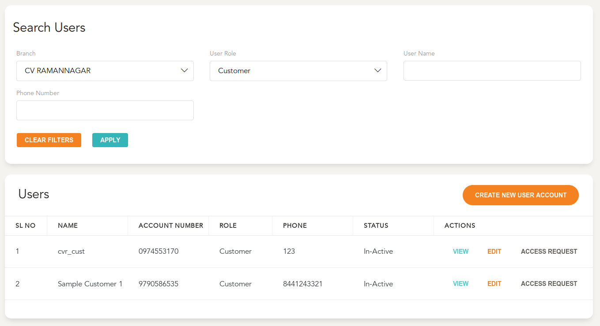
   
  
  - Select the branch to which the user is associated to 
    -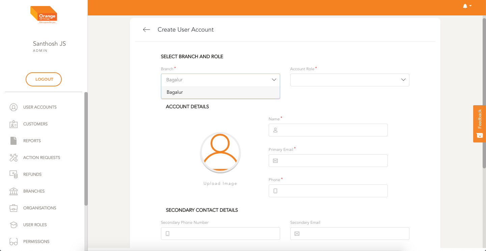  
  - Select Role of the User
    -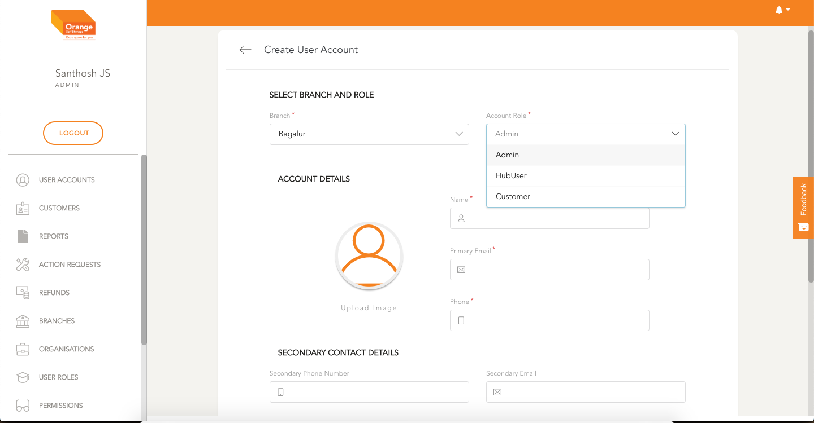 
  - Fill out all Mandatory and Optional Fields in the form
    -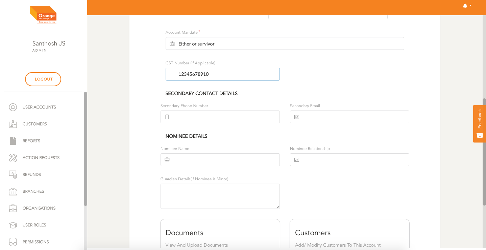
   
   
   
  - Upload any necessary Documents for the User Account
  - Select `Add/Edit Documents` To add documents to the Customer Profile
  -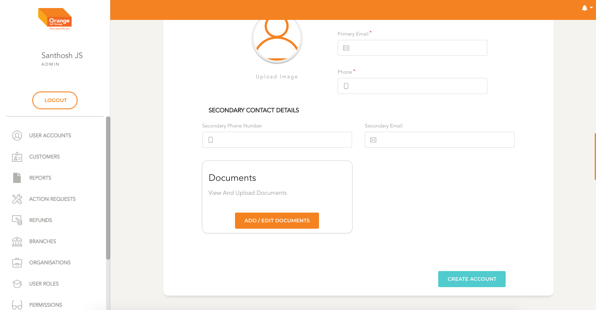  

  - When creating an User Account of Customer Role its neccessary to add Customers to this account
  - Click on `Add/Edit Customers` to open the Customer Add View
  -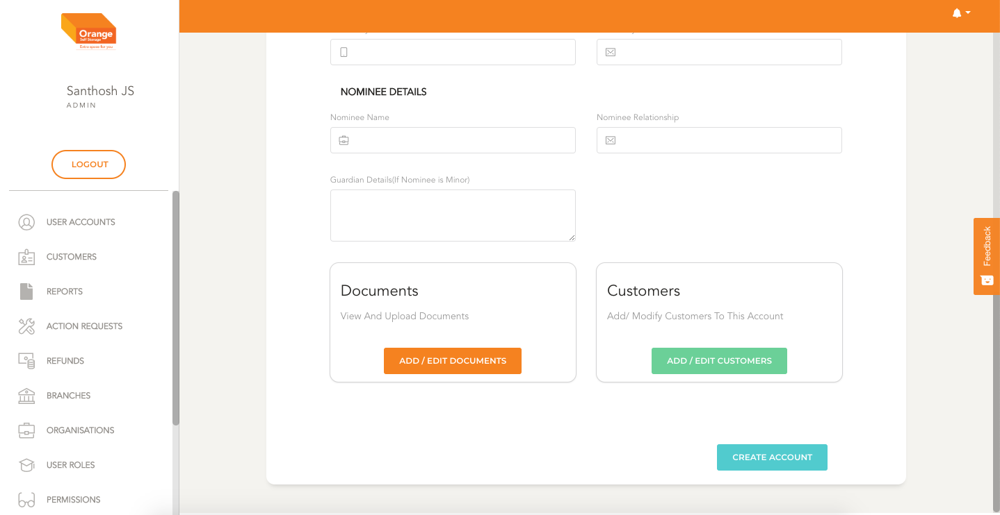    
  - Select Search and Upload all the related users to this account
  - Select `Add/Edit Documents` To add documents to the Customer Profile
  -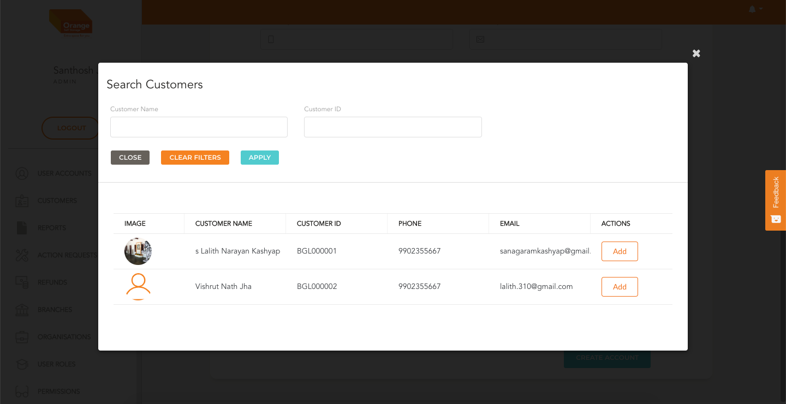  

  - Select Customers and assign one of them as the primary to this Account
  -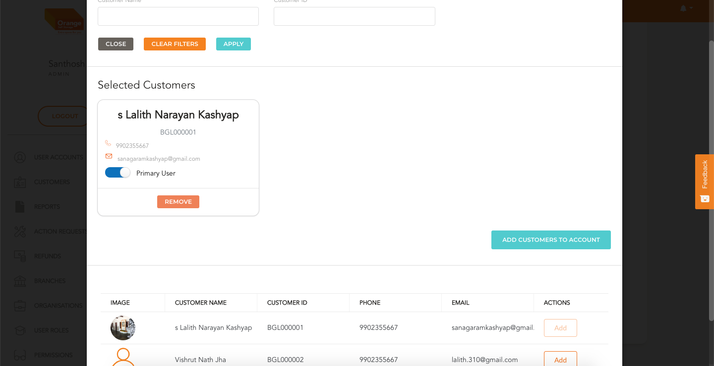  

  -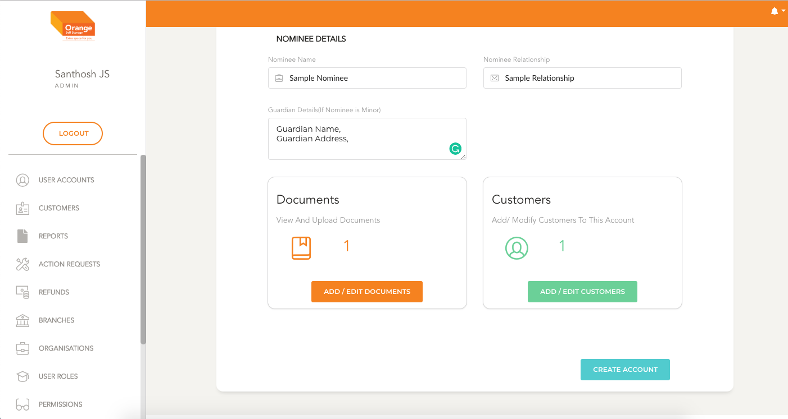   
  - Save and confirm Customer creation with `Create Account` button
    - This will create a User Account

# Edit Details

  >- As Admin:
    - Edit User Details Directly
    - Change form fields, add/edit Users
    - Upload additional Documents
    -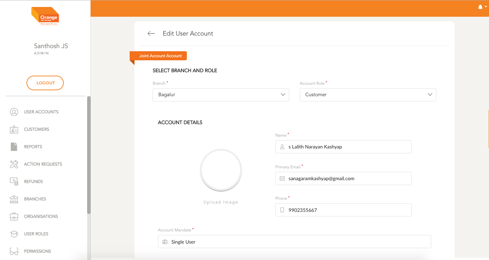
    

  >- As Hub User:
    - Every Edit is added through a `Change Request`
    -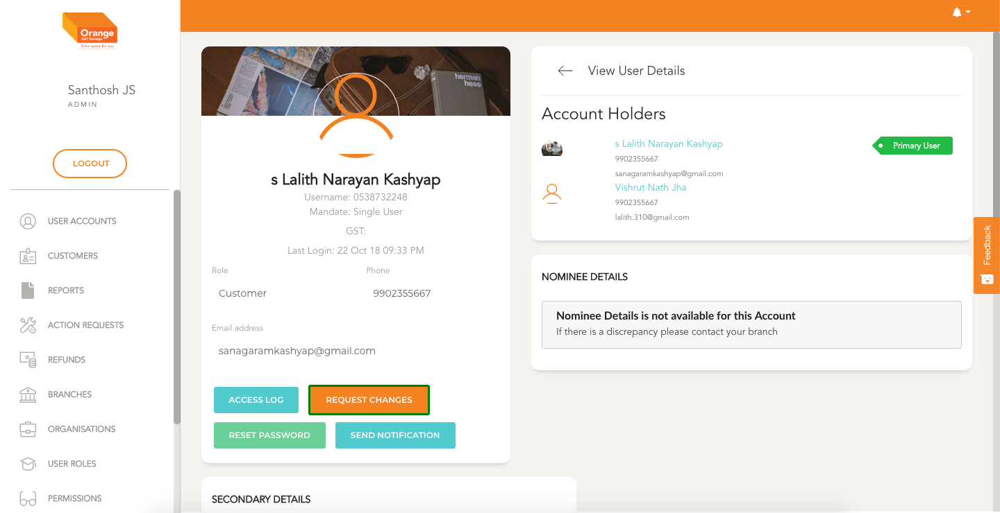
     
    - After Selecting Change Request, Add the necessary Details of the required change
    - Assign the specific change request to a specific Hub User* (optional)
    - Add any supporting Documents for this change
    - Create Change Request by clicking `Request Changes`
    -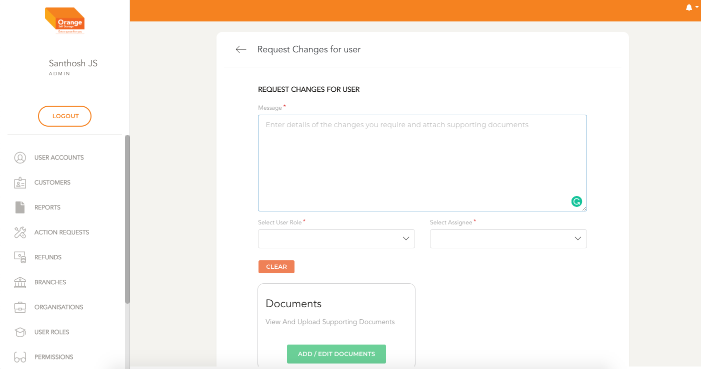
