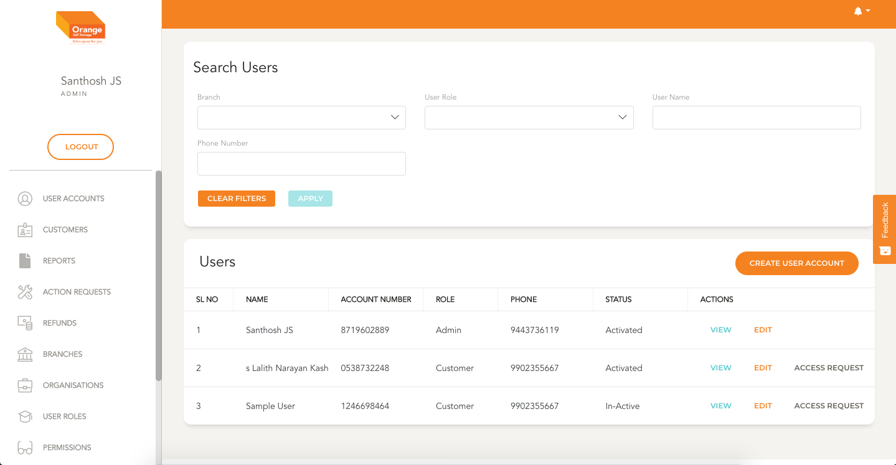
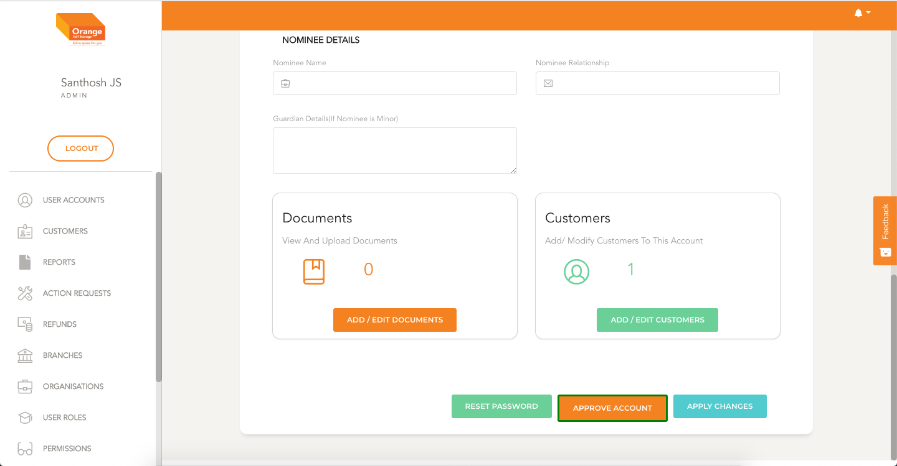

# User Account Verification

#### Prerequisites:
  - User Account needs to be created before it can be approved
  - User Account is auto created for every permanent Customer that is created
  - User account can be accessed from User Edit Page or View Page

# User Account Activation from User Edit Page
  **This Module can be accessed by clicking on `Edit` in User list Table**
  -

  - The Activation status of the User is shown on the user list status
  - User is taken to the user edit page.
  - If the account is not activated and if the logged in user has permission he can see a button `Approve Account`
  - Click to Activate the user

  
# User Account Activation from User View Page
  **This Module can be accessed by clicking on `View` in User list Table**
  - The Activation status of the User is shown on the user list status
  - User is taken to the user View page.
  - If the account is not activated and if the logged in user has permission he can see a button `Approve Account`
  - Click to Activate the user
   
   

   
   

### Quick references:

  * [Customer Request Management](customers/customerRequests.md)
  1. [Phase 1: Customer Details](customers/create.md) 
  1. [Phase 2: Customer Account Creation](customers/create.md)
