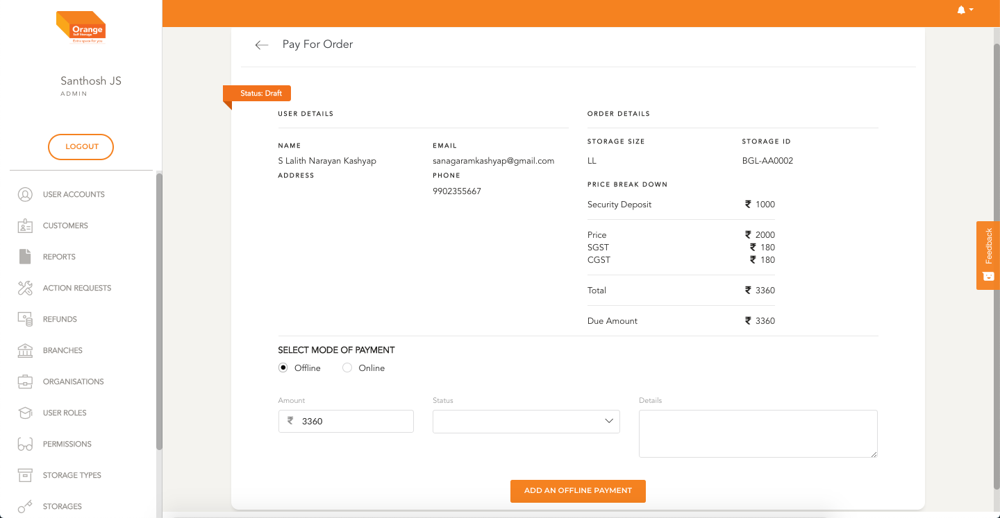
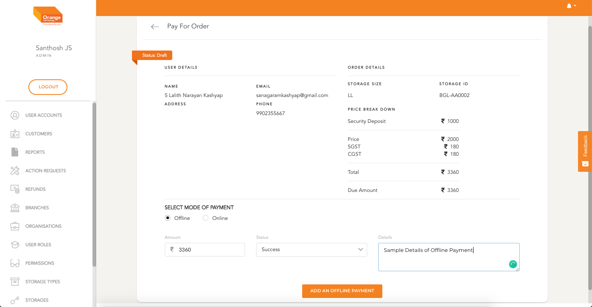
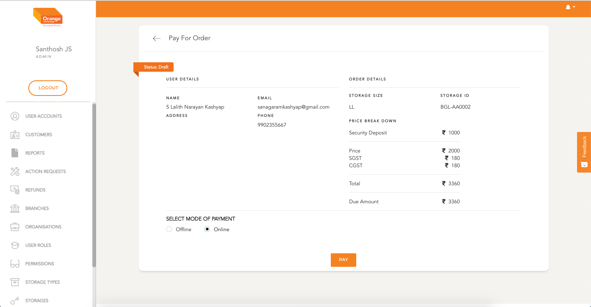
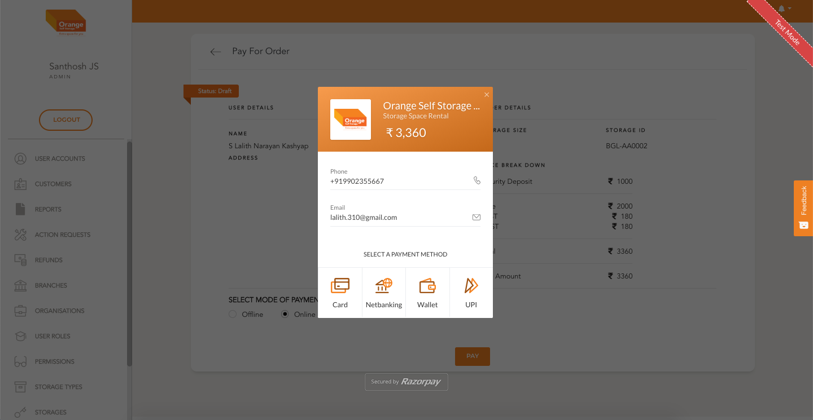
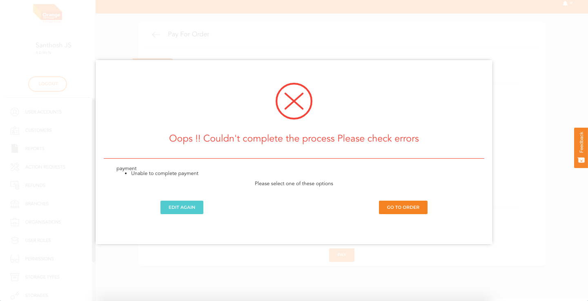
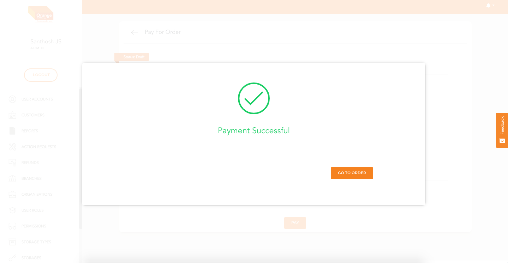

# Pay For Order

- This component can be used to pay for order
- User can access Pay For Order page either from Order Listing and `Pay` Button
**OR**
- User can go to order detail view and click `Pay`

**STEPS TO Pay for ORDER**
- Go to Pay for Order Page
- Select Mode of Payment `Online` or `Offline`
- If the user selects `Offline` the hub user can select the amount and status of payment and comments on payment

-
 
 
-
 
 
**Offline Payment**
-
 
 
-
 
 
**Payment Failure Screen**
-
 
 
**Payment Success Screen**
-

