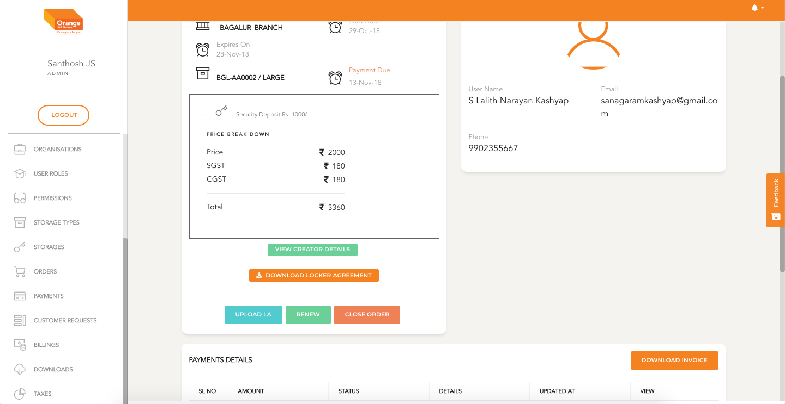
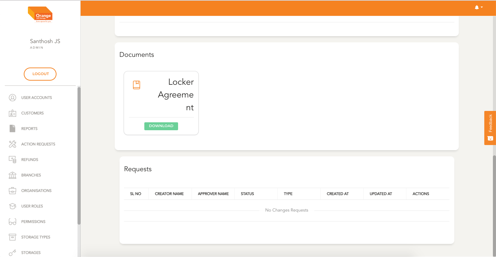

# View

- This component shows the details of order
- User can Pay, Raise a Request to Close the order, Upload Locker Agreement,
- User can view payments made and can download invoice

**STEPS TO COMPLETE ORDER**
- [Create an Order](orders/create.md)
- [Make Payment](orders/pay.md)
- Once the Payment is Complete
- Download Locker Agreement
- Take neccessary signatures
- Upload Locker Agreement
- Click `Close Order` Fill details and submit

-
 
 
-
 
 
-

