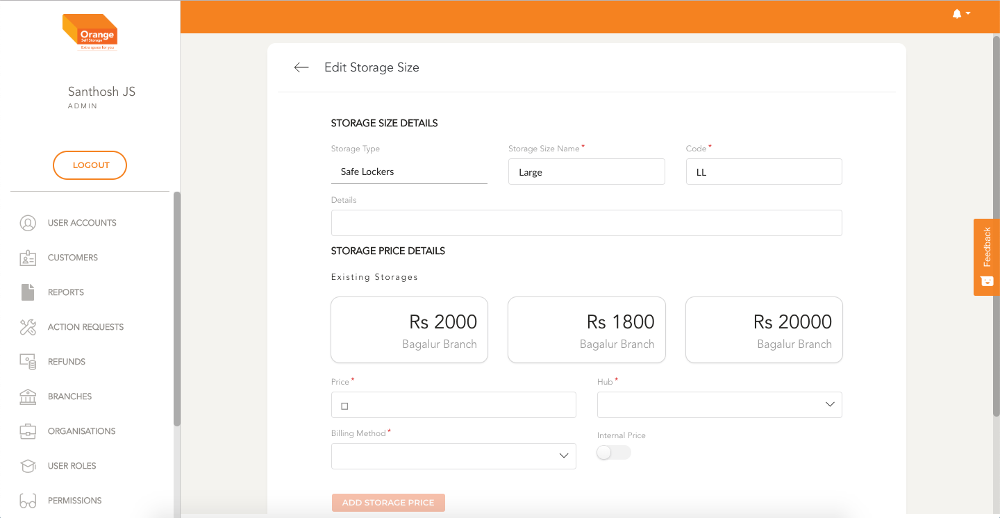

# Edit

- User can edit a Storage Size by clicking `Edit` from the table
- User can modify Storage Size Details
- User can add Storage Prices Associated with Storage Size
- User can't delete existing storage prices

**Edit the Storage Size**
-
 
