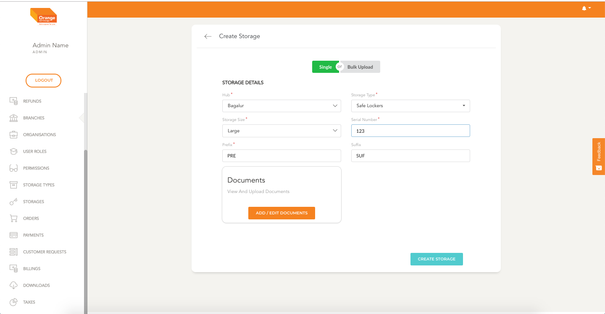
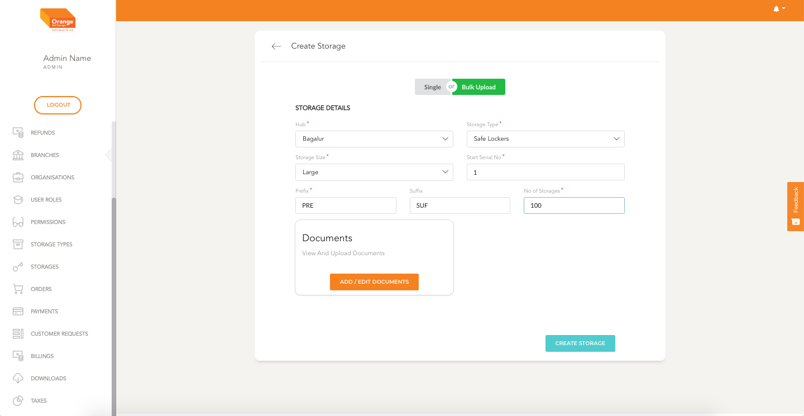
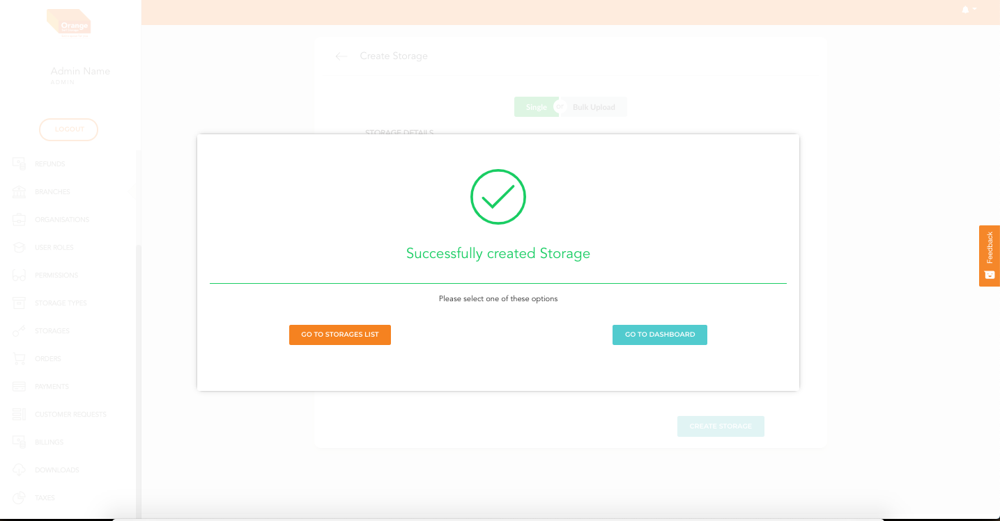
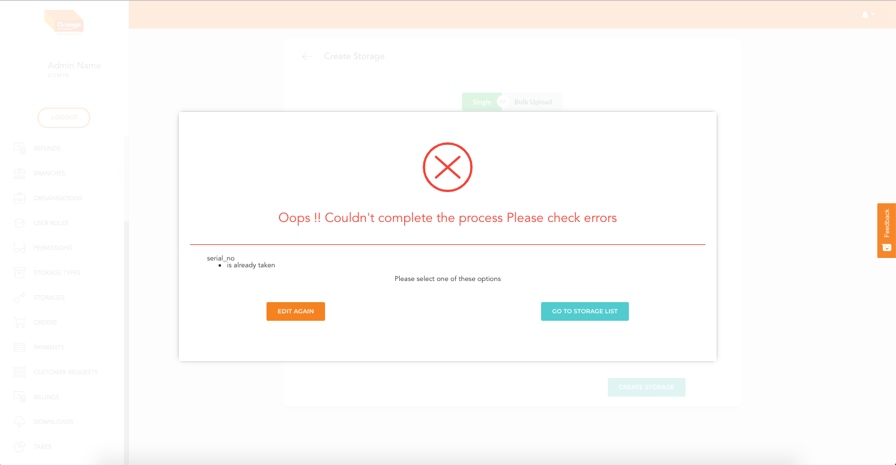

# Create

- User can create an Storages by clicking `Create Storages` from the table

**Create Single Storage**
- To Create a single storage click the Single button on the top of the page
- In the form that follows Fill details like the branch, storage type, storage size.
- To view the available storage sizes first select `Storage Type` 
- Fill the details like serial Number, Prefix and Suffix the user want to append for the storage identification
- You can add Documents associated with storage by clicking `Add Documents`
- Specify the document Name and upload the document.
- Once the form is filled click on `Create Storage`
-
 
-

**Create Storages in Bulk**
- To Create Bulk storages click the Bulk button on the top of the page
- In the form that follows Fill details like the branch, storage type, storage size.
- To view the available storage sizes first select `Storage Type` 
- Fill the details like Start Serial Number, Prefix and Suffix the user want to append for the storage identification
- Add the number of storages you want to add in the selected stotage type and size
- You can add Documents associated with storage by clicking `Add Documents`
- Specify the document Name and upload the document.
- Once the form is filled click on `Create Storage`

-
 
 
 
-

**On Successfull creation the user will see a Success Screen**
-

**If there are any errors in the form the error screen will show with the error**
- User can correct the errors and re submit
-
