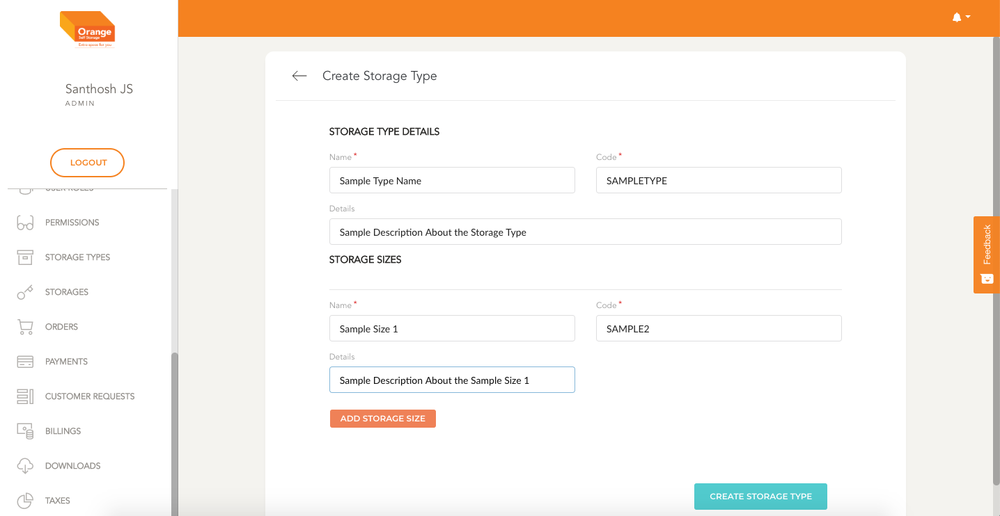
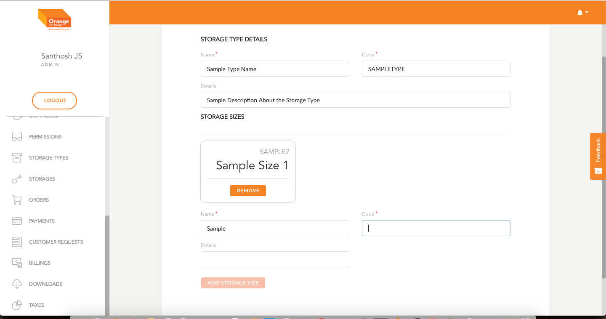

# Create

- User can create an Storage Type by clicking `Create Storage Type` from the table

**Create Storage Type**
- In the form Fill details like the Name, code and details.
- You can also add storage Sizes linked with storage type by filling the necessary details and clicking `Add Storage Size`
- Once the form is filled click on `Create Storage Type`

-
 
 
 
-

